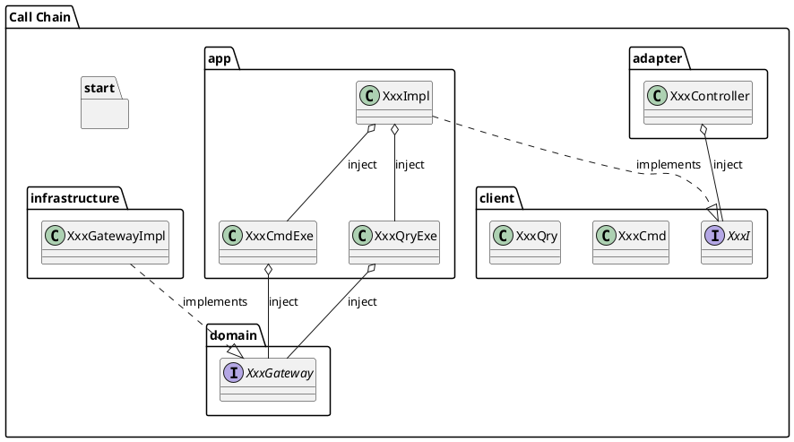

```plantuml
@startuml  
  
package "Call Chain" {  
    package start {}  
    package adapter {  
        class XxxController  
    }  
    package app {  
        class XxxImpl  
        class XxxCmdExe  
        class XxxQryExe  
    }  
    package client {  
        interface XxxI  
        class XxxCmd  
        class XxxQry  
    }  
  
    package domain {  
        interface XxxGateway  
    }  
  
    package infrastructure {  
        class XxxGatewayImpl  
    }  
  
    XxxController o-- XxxI : inject  
    XxxImpl ..|> XxxI : implements  
  
    XxxImpl o-- XxxQryExe : inject  
    XxxImpl o-- XxxCmdExe : inject  
  
    XxxQryExe o-- XxxGateway : inject  
    XxxCmdExe o-- XxxGateway: inject  
  
    XxxGatewayImpl ..|> XxxGateway : implements  
}  
  
@enduml
```
