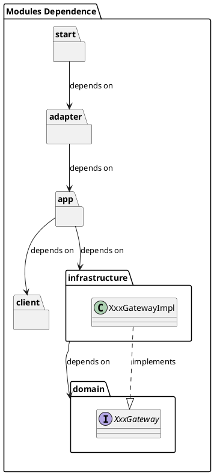

```plantuml
@startuml  
'https://plantuml.com/class-diagram  
  
package "Modules Dependence" {  
    package start {}  
    package adapter {  
  
    }  
    package app {  
  
    }  
    package client {  
  
    }  
  
    package domain {  
        interface XxxGateway  
    }  
  
    package infrastructure {  
        class XxxGatewayImpl  
    }  
  
    start --> adapter : depends on  
    adapter --> app : depends on  
    app --> client : depends on  
    app --> infrastructure : depends on  
    infrastructure --> domain : depends on  
  
    XxxGatewayImpl ..|> XxxGateway : implements  
  
  
  
}  
@enduml
```
