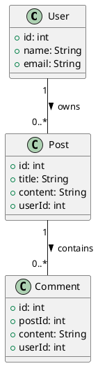

Demo:

```plantuml
@startuml  
  
class User {  
    +id: int  
    +name: String  
    +email: String  
}  
  
class Post {  
    +id: int  
    +title: String  
    +content: String  
    +userId: int  
}  
  
class Comment {  
    +id: int  
    +postId: int  
    +content: String  
    +userId: int  
}  
  
' 表示表之间的关系  
User "1" -- "0..*" Post : owns >  
Post "1" -- "0..*" Comment : contains >  
  
@enduml
```