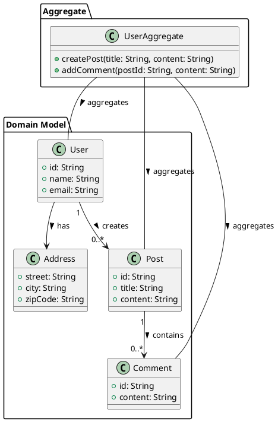

在领域驱动设计（DDD）中，可以使用 PlantUML 来表示领域模型、聚合、实体、值对象等概念。以下是一个简单的 DDD 示例，展示了如何使用 PlantUML 来表示这些元素：

### 解释：

1. **领域模型**：
   - `User`、`Post` 和 `Comment` 是实体，表示核心业务对象。
   - `Address` 是一个值对象，表示与用户相关的地址信息。

2. **聚合**：
   - `UserAggregate` 是聚合根，管理与用户、帖子和评论相关的操作。

3. **关系**：
   - `User` 创建多个 `Post`，每个 `Post` 可以有多个 `Comment`。
   - `User` 拥有一个 `Address`。

这个示例展示了如何使用 PlantUML 表达 DDD 的基本概念。你可以在支持 PlantUML 的工具中渲染这个代码，以查看生成的图示。根据实际需求，你可以进一步扩展和调整模型。