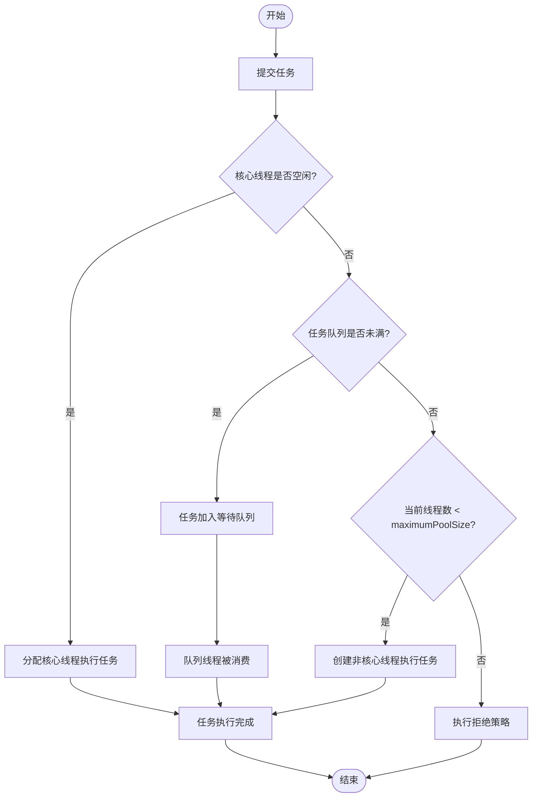

```mermaid

flowchart TD
    A([开始]) --> B[提交任务]
    B --> C{核心线程是否空闲?}
    C -->|是| D[分配核心线程执行任务]
    C -->|否| E{任务队列是否未满?}
    E -->|是| F[任务加入等待队列]
    E -->|否| G{当前线程数 < maximumPoolSize?}
    G -->|是| H[创建非核心线程执行任务]
    G -->|否| I[执行拒绝策略]
    D --> J[任务执行完成]
    F --> K[队列线程被消费]
    H --> J
    K --> J
    I --> L([结束])
    J --> L
```

# Reference