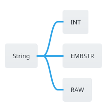

为什么 Redis 不直接使用 `char*` 呢？

`char*` 的不足：
- 操作效率低：获取长度需遍历，`O(N)`复杂度
- 二进制不安全：无法存储包含 `\0` 的数据

SDS 的优势：
- 操作效率高：获取长度无需遍历，`O(1)`复杂度
- 二进制安全：因单独记录长度字段，所以可存储包含 `\0` 的数据
- 兼容 C 字符串函数，可直接使用字符串 API

Redis String 类型有三种编码方式：

# `INT` 编码

Redis 如果发现存入的值是整数，则会使用 `INT` 编码，可能会使用到 [Redis共享对象](Redis共享对象)。使用整数时，直接将 redisObject 的 ptr 指针赋值为整数值即可。

源码可参考方法 `createStringObjectFromLongLongWithOptions`
# `EMBSTR` 编码

当字符串长度小于等于 44（`OBJ_ENCODING_EMBSTR_SIZE_LIMIT`） 时，会创建 `EMBSTR` 的 String 类型，redisObject 对象和 sds 对象一起分配，这种编码方式内存更加紧凑。


`EMBSTR` 为只读字符串，当发生了修改，会变更为 `RAW` 编码。这里需要注意 `SET` 一个已有的值属于新建，而不属于修改。
```shell
127.0.0.1:6379> set name erpang
OK
127.0.0.1:6379> OBJECT ENCODING name
"embstr"
127.0.0.1:6379> APPEND name -shi
(integer) 10
127.0.0.1:6379> OBJECT ENCODING name
"raw"
127.0.0.1:6379> set name erpang
OK
127.0.0.1:6379> OBJECT ENCODING name
"embstr"
127.0.0.1:6379> 
```

# `RAW` 编码

当 `EMBSTR` 编码的字符串被修改、大于 44 字节的字符串且不是整数（在最大范围之内），则会使用 `RAW` 编码。


# `SDS` 数据结构

Redis 没有使用 C 的字符串作为 Redis 字符串的实现，而是使用了 `SDS` 的数据结构，Simple Dynamic Sring。

针对不同的字符串长度，为了更加高效得使用内存，Redis 定义了多个 SDS 用来表示不同长度的字符串：
* `sdshdr5`，不会在 Value 中使用，只会在 Key 中使用。
* `sdshdr8`
* `sdshdr16`
* `sdshdr32`
* `sdshdr64`

源码如下：
```c
//sds.h
struct __attribute__ ((__packed__)) sdshdr5 {
    unsigned char flags; /* 3 lsb of type, and 5 msb of string length */
    char buf[];
};
struct __attribute__ ((__packed__)) sdshdr8 {
    uint8_t len; /* used */
    uint8_t alloc; /* excluding the header and null terminator */
    unsigned char flags; /* 3 lsb of type, 5 unused bits */
    char buf[];
};
// 其他类似
```

使用 SDS 有什么好处？
* `O(1)` 获取字符串长度
* 记录了内存大小和字符串长度，在类似拼接字符串等操作时，不会造成缓冲区溢出
* 内存空间预分配可以减少内存分配次数，但同时也带来了内存碎片的问题
* 兼容 Linux C 字符串函数

## 预留空间分配逻辑

当需要扩容时，Redis 在给 SDS 分配内存时会采用预留空间机制，具体来说当字符串大小小于 `SDS_MAX_PREALLOC` （`#define SDS_MAX_PREALLOC (1024*1024)` 1 M）时分配两倍，大于 `SDS_MAX_PREALLOC` 分配 `SDS_MAX_PREALLOC` 大小。

例如 Append 字符串时，扩容的大小为（原字符串 Length + Append 字符串 Length）* 2。

源码可参考方法：`sdsMakeRoomFor`


同样，既然有扩容，那肯定有缩容，当判断到可用空间大于字符串长度的十分之一时，会进行缩容操作。

源代码：

```c
/* Optimize the SDS string inside the string object to require little space,
 * in case there is more than 10% of free space at the end of the SDS. */
void trimStringObjectIfNeeded(robj *o, int trim_small_values) {
    if (o->encoding != OBJ_ENCODING_RAW) return;
    /* A string may have free space in the following cases:
     * 1. When an arg len is greater than PROTO_MBULK_BIG_ARG the query buffer may be used directly as the SDS string.
     * 2. When utilizing the argument caching mechanism in Lua. 
     * 3. When calling from RM_TrimStringAllocation (trim_small_values is true). */
    size_t len = sdslen(o->ptr);
    if (len >= PROTO_MBULK_BIG_ARG ||
        trim_small_values||
        (server.executing_client && server.executing_client->flags & CLIENT_SCRIPT && len < LUA_CMD_OBJCACHE_MAX_LEN)) {
        if (sdsavail(o->ptr) > len/10) {
            o->ptr = sdsRemoveFreeSpace(o->ptr, 0);
        }
    }
}

```


# References
* [How is the memory usage for the key-value calculated? · redis/redis · Discussion #13677 · GitHub](https://github.com/redis/redis/discussions/13677)
* [Analyzing Redis Source Code: Simple Dynamic Strings (SDS) – An Efficient and Flexible String Implementation \| Johnson Lin](https://www.linjiangxiong.com/2024/09/10/analyzing-redis-source-code-sds/index.html)
* [🚀深入理解redis的简单动态字符串（SDS）🚀Redis是一款流行的高性能键值存储数据库，而简单动态字符串SDS是 - 掘金](https://juejin.cn/post/7304183129896173568)
* [Redis Strings \| Docs](https://redis.io/docs/latest/develop/data-types/strings/)
* [Redis源码-String：Redis String命令、Redis String存储原理、Redis String三种编码类型、Redis字符串SDS源码解析、Redis String应用场景\_redis的string存储原理-CSDN博客](https://blog.csdn.net/qq_41929714/article/details/126060599)
* [04 \| 内存友好的数据结构该如何细化设计？-Redis源码剖析与实战-极客时间](https://time.geekbang.org/column/article/402223)
* 