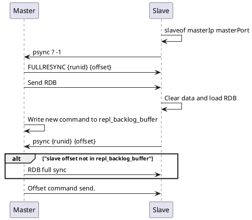

Redis 主从库读写分离
```c
replicaof ip port
```

流程：



Send RDB 这一步，可能有两种方式（repl-diskless-sync yes）：
1. 先生成 RDB 文件，再发送
2. 直接网络发送 RDB，如果在等待时间之外（repl-diskless-sync-delay 5），有其他 Replica 同步请求则会进入队列进行等待当前副本全量同步结束，否则可以并发发送


> # Set the replication backlog size. The backlog is a buffer that accumulates
> # replica data when replicas are disconnected for some time, so that when a
> # replica wants to reconnect again, often a full resync is not needed, but a
> # partial resync is enough, just passing the portion of data the replica
> # missed while disconnected.
> #
> # The bigger the replication backlog, the longer the replica can endure the
> # disconnect and later be able to perform a partial resynchronization.
> #
> # The backlog is only allocated if there is at least one replica connected.
> #
> # repl-backlog-size 1mb

因此，我们要想办法避免这一情况，一般而言，我们可以调整 repl_backlog_size 这个参数。这个参数和所需的缓冲空间大小有关。缓冲空间的计算公式是：缓冲空间大小 = 主库写入命令速度 * 操作大小 - 主从库间网络传输命令速度 * 操作大小。在实际应用中，考虑到可能存在一些突发的请求压力，我们通常需要把这个缓冲空间扩大一倍，即 repl_backlog_size = 缓冲空间大小 * 2，这也就是 repl_backlog_size 的最终值。举个例子，如果主库每秒写入 2000 个操作，每个操作的大小为 2KB，网络每秒能传输 1000 个操作，那么，有 1000 个操作需要缓冲起来，这就至少需要 2MB 的缓冲空间。否则，新写的命令就会覆盖掉旧操作了。为了应对可能的突发压力，我们最终把 repl_backlog_size 设为 4MB。

> 有同学对repl_backlog_buffer和replication buffer理解比较混淆，我大概解释一下：
> 
> 1、repl_backlog_buffer：就是上面我解释到的，它是为了从库断开之后，如何找到主从差异数据而设计的环形缓冲区，从而避免全量同步带来的性能开销。如果从库断开时间太久，repl_backlog_buffer环形缓冲区被主库的写命令覆盖了，那么从库连上主库后只能乖乖地进行一次全量同步，所以repl_backlog_buffer配置尽量大一些，可以降低主从断开后全量同步的概率。而在repl_backlog_buffer中找主从差异的数据后，如何发给从库呢？这就用到了replication buffer。
> 
> 2、replication buffer：Redis和客户端通信也好，和从库通信也好，Redis都需要给分配一个 内存buffer进行数据交互，客户端是一个client，从库也是一个client，我们每个client连上Redis后，Redis都会分配一个client buffer，所有数据交互都是通过这个buffer进行的：Redis先把数据写到这个buffer中，然后再把buffer中的数据发到client socket中再通过网络发送出去，这样就完成了数据交互。所以主从在增量同步时，从库作为一个client，也会分配一个buffer，只不过这个buffer专门用来传播用户的写命令到从库，保证主从数据一致，我们通常把它叫做replication buffer。
> 
> 3、再延伸一下，既然有这个内存buffer存在，那么这个buffer有没有限制呢？如果主从在传播命令时，因为某些原因从库处理得非常慢，那么主库上的这个buffer就会持续增长，消耗大量的内存资源，甚至OOM。所以Redis提供了client-output-buffer-limit参数限制这个buffer的大小，如果超过限制，主库会强制断开这个client的连接，也就是说从库处理慢导致主库内存buffer的积压达到限制后，主库会强制断开从库的连接，此时主从复制会中断，中断后如果从库再次发起复制请求，那么此时可能会导致恶性循环，引发复制风暴，这种情况需要格外注意。

Slave log:
```c
1:S 27 Nov 2024 12:37:36.983 # User requested shutdown...
1:S 27 Nov 2024 12:37:36.983 * Calling fsync() on the AOF file.
1:S 27 Nov 2024 12:37:36.983 * Saving the final RDB snapshot before exiting.
1:S 27 Nov 2024 12:37:36.987 * DB saved on disk
1:S 27 Nov 2024 12:37:36.987 * Removing the pid file.
1:S 27 Nov 2024 12:37:36.987 # Redis is now ready to exit, bye bye...
1:C 27 Nov 2024 12:38:09.658 # oO0OoO0OoO0Oo Redis is starting oO0OoO0OoO0Oo
1:C 27 Nov 2024 12:38:09.658 # Redis version=7.0.15, bits=64, commit=00000000, modified=0, pid=1, just started
1:C 27 Nov 2024 12:38:09.658 # Configuration loaded
1:M 27 Nov 2024 12:38:09.659 * monotonic clock: POSIX clock_gettime
1:M 27 Nov 2024 12:38:09.660 * Running mode=standalone, port=6379.
1:M 27 Nov 2024 12:38:09.660 # WARNING: The TCP backlog setting of 511 cannot be enforced because /proc/sys/net/core/somaxconn is set to the lower value of 128.
1:M 27 Nov 2024 12:38:09.660 # Server initialized
1:M 27 Nov 2024 12:38:09.660 # WARNING Memory overcommit must be enabled! Without it, a background save or replication may fail under low memory condition. Being disabled, it can can also cause failures without low memory condition, see https://github.com/jemalloc/jemalloc/issues/1328. To fix this issue add 'vm.overcommit_memory = 1' to /etc/sysctl.conf and then reboot or run the command 'sysctl vm.overcommit_memory=1' for this to take effect.
1:M 27 Nov 2024 12:38:09.660 * Reading RDB base file on AOF loading...
1:M 27 Nov 2024 12:38:09.660 * Loading RDB produced by version 7.0.15
1:M 27 Nov 2024 12:38:09.660 * RDB age 586 seconds
1:M 27 Nov 2024 12:38:09.660 * RDB memory usage when created 0.94 Mb
1:M 27 Nov 2024 12:38:09.660 * RDB is base AOF
1:M 27 Nov 2024 12:38:09.660 * Done loading RDB, keys loaded: 0, keys expired: 0.
1:M 27 Nov 2024 12:38:09.660 * DB loaded from base file appendonly.aof.2.base.rdb: 0.000 seconds
1:M 27 Nov 2024 12:38:09.660 * DB loaded from append only file: 0.000 seconds
1:M 27 Nov 2024 12:38:09.660 * Opening AOF incr file appendonly.aof.2.incr.aof on server start
1:M 27 Nov 2024 12:38:09.660 * Ready to accept connections
1:S 27 Nov 2024 12:39:30.562 * Before turning into a replica, using my own master parameters to synthesize a cached master: I may be able to synchronize with the new master with just a partial transfer.
1:S 27 Nov 2024 12:39:30.562 * Connecting to MASTER redis-master:6379
1:S 27 Nov 2024 12:39:30.563 * MASTER <-> REPLICA sync started
1:S 27 Nov 2024 12:39:30.563 * REPLICAOF redis-master:6379 enabled (user request from 'id=5 addr=127.0.0.1:60198 laddr=127.0.0.1:6379 fd=10 name= age=10 idle=0 flags=N db=0 sub=0 psub=0 ssub=0 multi=-1 qbuf=48 qbuf-free=20426 argv-mem=25 multi-mem=0 rbs=1024 rbp=0 obl=0 oll=0 omem=0 tot-mem=22321 events=r cmd=replicaof user=default redir=-1 resp=2')
1:S 27 Nov 2024 12:39:30.563 * Non blocking connect for SYNC fired the event.
1:S 27 Nov 2024 12:39:30.563 * Master replied to PING, replication can continue...
1:S 27 Nov 2024 12:39:30.563 * Trying a partial resynchronization (request c87f57d4ff44073db6335de638d5fc6c19310f9d:1).
1:S 27 Nov 2024 12:39:35.865 * Full resync from master: a13f3ff7a9c3bd4ce3ba7d552cf23a3a0c70b682:0
1:S 27 Nov 2024 12:39:35.866 * MASTER <-> REPLICA sync: receiving streamed RDB from master with EOF to disk
1:S 27 Nov 2024 12:39:35.866 * Discarding previously cached master state.
1:S 27 Nov 2024 12:39:35.866 * MASTER <-> REPLICA sync: Flushing old data
1:S 27 Nov 2024 12:39:35.866 * MASTER <-> REPLICA sync: Loading DB in memory
1:S 27 Nov 2024 12:39:35.871 * Loading RDB produced by version 7.0.15
1:S 27 Nov 2024 12:39:35.871 * RDB age 0 seconds
1:S 27 Nov 2024 12:39:35.871 * RDB memory usage when created 0.97 Mb
1:S 27 Nov 2024 12:39:35.871 * Done loading RDB, keys loaded: 2, keys expired: 0.
1:S 27 Nov 2024 12:39:35.871 * MASTER <-> REPLICA sync: Finished with success
1:S 27 Nov 2024 12:39:35.871 * Creating AOF incr file temp-appendonly.aof.incr on background rewrite
1:S 27 Nov 2024 12:39:35.871 * Background append only file rewriting started by pid 40
40:C 27 Nov 2024 12:39:35.874 * Successfully created the temporary AOF base file temp-rewriteaof-bg-40.aof
40:C 27 Nov 2024 12:39:35.875 * Fork CoW for AOF rewrite: current 0 MB, peak 0 MB, average 0 MB
1:S 27 Nov 2024 12:39:35.933 * Background AOF rewrite terminated with success
1:S 27 Nov 2024 12:39:35.933 * Successfully renamed the temporary AOF base file temp-rewriteaof-bg-40.aof into appendonly.aof.3.base.rdb
1:S 27 Nov 2024 12:39:35.933 * Successfully renamed the temporary AOF incr file temp-appendonly.aof.incr into appendonly.aof.3.incr.aof
1:S 27 Nov 2024 12:39:35.942 * Removing the history file appendonly.aof.2.incr.aof in the background
1:S 27 Nov 2024 12:39:35.942 * Removing the history file appendonly.aof.2.base.rdb in the background
1:S 27 Nov 2024 12:39:35.958 * Background AOF rewrite finished successfully
1:S 27 Nov 2024 12:40:16.876 * REPLICAOF would result into synchronization with the master we are already connected with. No operation performed.
```

Master log:
```c
1:M 27 Nov 2024 12:38:09.692 # WARNING Memory overcommit must be enabled! Without it, a background save or replication may fail under low memory condition. Being disabled, it can can also cause failures without low memory condition, see https://github.com/jemalloc/jemalloc/issues/1328. To fix this issue add 'vm.overcommit_memory = 1' to /etc/sysctl.conf and then reboot or run the command 'sysctl vm.overcommit_memory=1' for this to take effect.
1:M 27 Nov 2024 12:38:09.692 * Reading RDB base file on AOF loading...
1:M 27 Nov 2024 12:38:09.692 * Loading RDB produced by version 7.0.15
1:M 27 Nov 2024 12:38:09.692 * RDB age 3014 seconds
1:M 27 Nov 2024 12:38:09.692 * RDB memory usage when created 0.82 Mb
1:M 27 Nov 2024 12:38:09.692 * RDB is base AOF
1:M 27 Nov 2024 12:38:09.692 * Done loading RDB, keys loaded: 0, keys expired: 0.
1:M 27 Nov 2024 12:38:09.692 * DB loaded from base file appendonly.aof.1.base.rdb: 0.000 seconds
1:M 27 Nov 2024 12:38:09.692 * DB loaded from append only file: 0.000 seconds
1:M 27 Nov 2024 12:38:09.692 * Opening AOF incr file appendonly.aof.1.incr.aof on server start
1:M 27 Nov 2024 12:38:09.692 * Ready to accept connections
1:M 27 Nov 2024 12:39:30.564 * Replica 172.24.0.2:6379 asks for synchronization
1:M 27 Nov 2024 12:39:30.564 * Partial resynchronization not accepted: Replication ID mismatch (Replica asked for 'c87f57d4ff44073db6335de638d5fc6c19310f9d', my replication IDs are '62a8e75dcb39aa2cf77cda6f53a81d89c9d0c0d2' and '0000000000000000000000000000000000000000')
1:M 27 Nov 2024 12:39:30.564 * Replication backlog created, my new replication IDs are 'a13f3ff7a9c3bd4ce3ba7d552cf23a3a0c70b682' and '0000000000000000000000000000000000000000'
1:M 27 Nov 2024 12:39:30.564 * Delay next BGSAVE for diskless SYNC
1:M 27 Nov 2024 12:39:35.865 * Starting BGSAVE for SYNC with target: replicas sockets
1:M 27 Nov 2024 12:39:35.865 * Background RDB transfer started by pid 27
27:C 27 Nov 2024 12:39:35.866 * Fork CoW for RDB: current 0 MB, peak 0 MB, average 0 MB
1:M 27 Nov 2024 12:39:35.866 # Diskless rdb transfer, done reading from pipe, 1 replicas still up.
1:M 27 Nov 2024 12:39:35.871 * Background RDB transfer terminated with success
1:M 27 Nov 2024 12:39:35.871 * Streamed RDB transfer with replica 172.24.0.2:6379 succeeded (socket). Waiting for REPLCONF ACK from slave to enable streaming
1:M 27 Nov 2024 12:39:35.871 * Synchronization with replica 172.24.0.2:6379 succeeded
root@2a0da0ca839c:/data# 
```

# References
* [06 | 数据同步：主从库如何实现数据一致？-Redis核心技术与实战-极客时间](https://time.geekbang.org/column/article/272852)