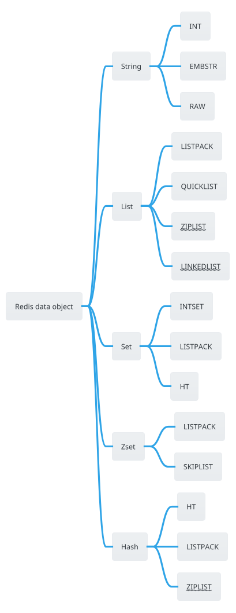

Redis 提供了丰富的数据类型帮助用户解决需要缓存、队列和事件处理的各种问题，Redis 社区版提供了以下数据类型：
- [String](https://redis.io/docs/latest/develop/data-types/#strings)
- [Hash](https://redis.io/docs/latest/develop/data-types/#hashes)
- [List](https://redis.io/docs/latest/develop/data-types/#lists)
- [Set](https://redis.io/docs/latest/develop/data-types/#sets)
- [Sorted set](https://redis.io/docs/latest/develop/data-types/#sorted-sets)
- [Stream](https://redis.io/docs/latest/develop/data-types/#streams)
- [Bitmap](https://redis.io/docs/latest/develop/data-types/#bitmaps)
- [Bitfield](https://redis.io/docs/latest/develop/data-types/#bitfields)
- [Geospatial](https://redis.io/docs/latest/develop/data-types/#geospatial-indexes)

Redis Database 整体而言是一个巨大的哈希表，都是以 key-value 键值对的形式存储的，其中 key 以 String 对象存储，Value 以 [Redis对象](Redis对象) 存储，Redis 有 7 种数据对象：
* [String object](Redis-String.md)
* [List object](Redis-List.md)
* Set object
* Sorted set object
* Hash object
* Module object
* Stream object

某些 Redis 数据对象（比如 String、Hash 等）根据数据长度和数据量而采用不同的数据结构，称为数据对象编码方式：

```c
#define OBJ_ENCODING_RAW 0     /* Raw representation */
#define OBJ_ENCODING_INT 1     /* Encoded as integer */
#define OBJ_ENCODING_HT 2      /* Encoded as hash table */
#define OBJ_ENCODING_ZIPMAP 3  /* No longer used: old hash encoding. */
#define OBJ_ENCODING_LINKEDLIST 4 /* No longer used: old list encoding. */
#define OBJ_ENCODING_ZIPLIST 5 /* No longer used: old list/hash/zset encoding. */
#define OBJ_ENCODING_INTSET 6  /* Encoded as intset */
#define OBJ_ENCODING_SKIPLIST 7  /* Encoded as skiplist */
#define OBJ_ENCODING_EMBSTR 8  /* Embedded sds string encoding */
#define OBJ_ENCODING_QUICKLIST 9 /* Encoded as linked list of listpacks */
#define OBJ_ENCODING_STREAM 10 /* Encoded as a radix tree of listpacks */
#define OBJ_ENCODING_LISTPACK 11 /* Encoded as a listpack */
#define OBJ_ENCODING_LISTPACK_EX 12 /* Encoded as listpack, extended with metadata */
```

数据对象对应的编码方式如下：

# References
