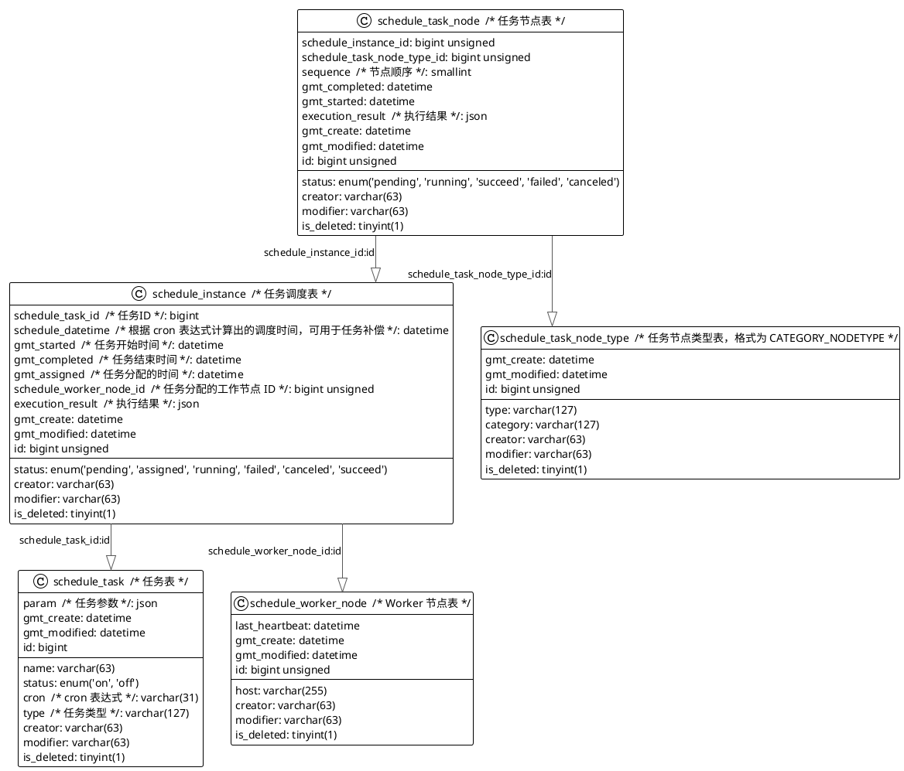

# 定时调度分类

分为两类：
* 单机调度系统
	* 基于延时队列
	* 基于时间轮
* 分布式调度系统
	* 中心化，由调度器执行
	* 去中心化


# 定时调度设计

## 库表设计




## 调度器怎么调度？

核心 SQL 设计：

```sql
EXPLAIN SELECT id FROM schedule_task WHERE schedule_task.status = 'ON' AND id NOT IN (SELECT distinct (schedule_task_id) FROM schedule_instance WHERE schedule_instance.status = 'PENDING' and schedule_instance.status = 'ASSIGNED') LIMIT 1;  
  
# 调度器流程  
# 获取所有的可调度任务  
SELECT * FROM schedule_task WHERE status = 'ON' and is_deleted = 0;  
  
# 根据 cron 表达式注册定时调度  
  
# 到达时间后  
SELECT COUNT(schedule_instance.schedule_task_id) FROM schedule_instance WHERE schedule_task_id = ? AND status < 'RUNNING';  
# 如果已经创建了，则跳过  
# 如果没有创建，上锁  
UPDATE schedule_task_lock SET locked_by = ?, locked_at = NOW(), is_locked = 1 WHERE schedule_task_id = ? AND locked_by IS NULL;  
    # 再查一次如果存在了则直接跳过  
    SELECT COUNT(schedule_instance.schedule_task_id) FROM schedule_instance WHERE schedule_task_id = ? AND status < 'RUNNING';  
    # 查找一个可用的负载最小的 Worker    SELECT * FROM schedule_worker_node WHERE (last_heartbeat >= NOW() - INTERVAL 1 MINUTE) ORDER BY current_load LIMIT 1;  
    # 创建 schedule_instance record.    INSERT schedule_instance (schedule_task_id, schedule_datetime, schedule_worker_node_id) VALUES(?, ?, ?);  
# 释放锁  
UPDATE schedule_task_lock SET locked_by = NULL, locked_at = NULL, is_locked = 0 WHERE schedule_task_id = ? AND locked_by = ?;  
  
# Worker 流程  
# 采用拉取任务模式，每 1s 执行一次  
SELECT * FROM schedule_instance WHERE schedule_worker_node_id = ? AND status = 'ASSIGNED' AND schedule_datetime < NOW();  
# 为了防止重复执行，需要通过 CMap schedule_instance_id - 任务 防止重复执行
```


## 推拉模式考虑

关于调度器如何与 Worker 节点进行通信的设计，主要有两种方式：

1. **调度器主动通知 Worker 执行任务**（推送模式）。
2. **Worker 自己定期拉取任务**（拉取模式）。

每种模式都有其优点和缺点，选择哪种方式取决于你的具体需求、系统架构和负载要求。我们可以分别讨论两种模式的特点以及优缺点：

### 1. **调度器主动通知 Worker 执行任务（推送模式）**

在推送模式中，调度器负责向 Worker 节点推送任务执行通知。通常，调度器会通过某种消息中间件（如 Kafka、RabbitMQ、Redis 等）向 Worker 发布任务消息，Worker 节点接收到任务后立即开始执行。

#### **流程：**
1. 调度器根据任务的 Cron 表达式或调度时间计算出需要执行的任务。
2. 调度器将任务信息通过消息中间件推送给 Worker 节点。
3. Worker 节点接收到任务消息后，开始执行任务。
4. Worker 执行完成后，更新任务状态并记录执行结果。

#### **优点：**
- **实时性强**：调度器可以精准控制任务何时推送到 Worker 节点，任务执行时间的控制精度较高。
- **资源利用率高**：由于 Worker 节点是被调度器唤醒来执行任务，因此可以避免不必要的轮询检查，提高系统效率。
- **易于扩展**：通过消息队列可以方便地将任务分发给多个 Worker 节点，实现任务的负载均衡。

#### **缺点：**
- **复杂性高**：需要引入消息中间件或事件驱动的机制，增加了系统复杂度。
- **可靠性问题**：如果消息中间件或调度器发生故障，可能导致任务调度失效或任务丢失。因此需要考虑消息的可靠投递、重试机制和消息确认机制。
- **单点故障**：调度器可能成为系统的单点故障，导致整个系统的调度失效。

### 2. **Worker 自己定期拉取任务（拉取模式）**

在拉取模式中，每个 Worker 节点定期（如每分钟）查询任务调度表，检查是否有待执行的任务。如果有，Worker 节点从数据库中获取任务并执行。

#### **流程：**
1. Worker 节点定期查询数据库（如 `schedule_instance` 表），查看是否有待执行的任务。
2. Worker 节点从数据库中获取任务并锁定任务，防止其他 Worker 节点重复执行。
3. Worker 节点执行任务，并更新任务状态。

#### **优点：**
- **实现简单**：不需要额外的消息中间件，使用现有的数据库即可实现任务的调度和管理。
- **容错性较强**：如果 Worker 节点没有及时查询到任务，任务并不会丢失，只是延迟执行。相对来说，系统的健壮性较高。
- **去中心化**：每个 Worker 节点是自给自足的，不依赖于调度器的通知，因此没有调度器单点故障的问题。

#### **缺点：**
- **实时性差**：由于 Worker 是定期拉取任务，可能会存在任务延迟执行的情况。例如，Worker 每 1 分钟拉取一次任务，如果任务需要在该分钟内执行，那么就会有最大 1 分钟的延迟。
- **资源浪费**：如果任务数量很少或 Worker 节点负载很低，定期轮询数据库会导致额外的查询开销，增加不必要的资源消耗。
- **扩展性较差**：虽然每个 Worker 节点都能独立拉取任务，但如果任务量很大时，可能会导致数据库查询的压力增大，影响系统性能。

### 3. **混合模式：推送与拉取结合**

为了弥补推送模式和拉取模式的缺点，一些系统采用 **推送与拉取结合** 的方式。比如，在正常情况下，Worker 定期拉取任务，但当任务的优先级较高时，调度器可以直接推送任务给 Worker。

#### **流程：**
4. 定期拉取：Worker 节点定期从数据库或任务调度表拉取任务。
5. 推送补充：调度器可以在特定情况下，基于任务的优先级、时效性等条件，主动向 Worker 节点推送任务。
6. 工作负载分配：系统可以根据当前负载状况，选择推送或拉取任务的方式。

### 4. **推荐方式**

#### 如果任务执行的时效性要求不高：
- **拉取模式** 可能是更好的选择。它实现简单，易于容错，避免了单点故障，并且没有额外的消息中间件开销。如果任务本身不要求非常精确的执行时间，Worker 节点可以定期拉取任务，确保任务按时完成。

#### 如果任务的执行时效性要求较高，或者需要更高的任务调度精度：
- **推送模式** 会更合适。通过消息中间件的推送，可以确保任务尽早被 Worker 节点处理，并且通过消息队列可以很容易地扩展多个 Worker 节点来分担任务负载。
- 如果推送模式采用消息中间件，系统可以确保任务在多个 Worker 之间均匀分配，且任务的调度实时性较高。

### **综合考虑：**
7. **任务量和规模**：如果任务量较大，拉取模式可能会导致数据库压力增大，推送模式通过消息中间件可以更高效地分配任务。
8. **系统复杂度**：如果你希望系统简单，且容错性较强，拉取模式可能更适合；如果对任务的执行实时性要求高，且系统需要横向扩展，推送模式更好。
9. **系统的可扩展性与容错性**：推送模式依赖消息队列，可能会面临消息丢失、重复发送等问题，需要额外考虑消息确认和重试机制；拉取模式系统简单且容错性高，不容易丢失任务。

### **结论**
- **小规模或低实时性要求**：使用 **拉取模式**，Worker 定期查询数据库。
- **高实时性要求或大规模任务**：使用 **推送模式**，调度器通过消息中间件向 Worker 推送任务。
- **混合模式**：对于高优先级任务，调度器可以选择推送模式，低优先级任务则使用拉取模式。

选择何种方式，还是需要结合你系统的业务场景、负载和扩展需求来做决定。
# Reference
* [ChatGPT - 任务调度系统设计](https://chatgpt.com/share/67bd8086-eafc-8009-9f3e-5059ac56c6b4)
* [SpringBoot 遇上状态机:简化复杂业务逻辑的利器 \| 小豆丁技术栈](http://www.mydlq.club/prepare/172/)
* [ChatGPT - 轻量级定时任务设计](https://chatgpt.com/share/67b42eed-7030-8009-88df-479a9bc813f4)
* [ChatGPT - 动态Cron表达式调度](https://chatgpt.com/share/67b4312f-9f7c-8009-bbb2-a67069a22108)
* [多流程节点抽象设计](https://lxblog.com/qianwen/share?shareId=56a13699-5926-446a-9df5-f39a372b7b88)
* [SpringBoot 遇上状态机:简化复杂业务逻辑的利器 \| 小豆丁技术栈](http://www.mydlq.club/prepare/172/)
* [Weixin Official Accounts Platform](https://mp.weixin.qq.com/s?__biz=MzkwMTM4NTg5Ng==&mid=2247489361&idx=1&sn=3bb76b38af9e6bda271af286e054e27c&chksm=c0b4cc96f7c34580cace9e6679582a0812116b8d35ec79fa42f3c85f2cc49be4703ce5e29d79&scene=21#wechat_redirect)
* [GitHub - Leme34/stateMachine: 参考：高德打车通用可编排订单状态机引擎设计](https://github.com/Leme34/stateMachine)
* [GitHub - Childe-Chen/statemachine: 状态机学习](https://github.com/Childe-Chen/statemachine)
* [Tiny Job 一个轻量级定时任务调度系统Tiny Job 轻量级定时任务调度系统 主要技术选型 1、后端： Spri - 掘金](https://juejin.cn/post/7260526125847986213)
* [基于数据库版本的分布式定时任务调度中心构建一个统一的调度系统，用于触发定时任务的调度。2.2.（可使用开源项目框架，但目 - 掘金](https://juejin.cn/post/7152791076431429645)
* [Java 定时任务详解 \| JavaGuide](https://javaguide.cn/system-design/schedule-task.html)