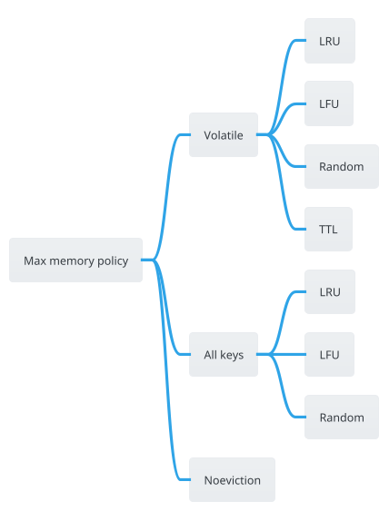

当内存占用满了之后，Redis 会根据配置进行数据淘汰，默认为不淘汰数据，写请求会报错，读请求正常处理，配置为：
```c
maxmemory-policy noeviction
```

Redis 提供了以下几种淘汰策略：


默认为 `noeviction`，`volatile` 表示在过期键中进行淘汰，`allkeys` 表示在所有键空间中淘汰数据，在 Redis 中，`LRU` `LFU` `TTL` 算法的实现都采用了近似随机算法（approximated randomized algorithms）。 

## 什么时候淘汰数据？


## Redis LRU 算法


```c
/* LRU approximation algorithm
 *
 * Redis uses an approximation of the LRU algorithm that runs in constant
 * memory. Every time there is a key to expire, we sample N keys (with
 * N very small, usually in around 5) to populate a pool of best keys to
 * evict of M keys (the pool size is defined by EVPOOL_SIZE).
 *
 * The N keys sampled are added in the pool of good keys to expire (the one
 * with an old access time) if they are better than one of the current keys
 * in the pool.
 *
 * After the pool is populated, the best key we have in the pool is expired.
 * However note that we don't remove keys from the pool when they are deleted
 * so the pool may contain keys that no longer exist.
 *
 * When we try to evict a key, and all the entries in the pool don't exist
 * we populate it again. This time we'll be sure that the pool has at least
 * one key that can be evicted, if there is at least one key that can be
 * evicted in the whole database. */

/* Create a new eviction pool. */
void evictionPoolAlloc(void) {
    struct evictionPoolEntry *ep;
    int j;

    ep = zmalloc(sizeof(*ep)*EVPOOL_SIZE);
    for (j = 0; j < EVPOOL_SIZE; j++) {
        ep[j].idle = 0;
        ep[j].key = NULL;
        ep[j].cached = sdsnewlen(NULL,EVPOOL_CACHED_SDS_SIZE);
        ep[j].dbid = 0;
    }
    EvictionPoolLRU = ep;
}
```

具体代码如下：
```c
/* Check that memory usage is within the current "maxmemory" limit.  If over
 * "maxmemory", attempt to free memory by evicting data (if it's safe to do so).
 *
 * It's possible for Redis to suddenly be significantly over the "maxmemory"
 * setting.  This can happen if there is a large allocation (like a hash table
 * resize) or even if the "maxmemory" setting is manually adjusted.  Because of
 * this, it's important to evict for a managed period of time - otherwise Redis
 * would become unresponsive while evicting.
 *
 * The goal of this function is to improve the memory situation - not to
 * immediately resolve it.  In the case that some items have been evicted but
 * the "maxmemory" limit has not been achieved, an aeTimeProc will be started
 * which will continue to evict items until memory limits are achieved or
 * nothing more is evictable.
 *
 * This should be called before execution of commands.  If EVICT_FAIL is
 * returned, commands which will result in increased memory usage should be
 * rejected.
 *
 * Returns:
 *   EVICT_OK       - memory is OK or it's not possible to perform evictions now
 *   EVICT_RUNNING  - memory is over the limit, but eviction is still processing
 *   EVICT_FAIL     - memory is over the limit, and there's nothing to evict
 * */
int performEvictions(void) {
    /* Note, we don't goto update_metrics here because this check skips eviction
     * as if it wasn't triggered. it's a fake EVICT_OK. */
    if (!isSafeToPerformEvictions()) return EVICT_OK;

    int keys_freed = 0;
    size_t mem_reported, mem_tofree;
    long long mem_freed; /* May be negative */
    mstime_t latency;
    int slaves = listLength(server.slaves);
    int result = EVICT_FAIL;

    if (getMaxmemoryState(&mem_reported,NULL,&mem_tofree,NULL) == C_OK) {
        result = EVICT_OK;
        goto update_metrics;
    }

    if (server.maxmemory_policy == MAXMEMORY_NO_EVICTION) {
        result = EVICT_FAIL;  /* We need to free memory, but policy forbids. */
        goto update_metrics;
    }

    unsigned long eviction_time_limit_us = evictionTimeLimitUs();

    mem_freed = 0;

    latencyStartMonitor(latency);

    monotime evictionTimer;
    elapsedStart(&evictionTimer);

    /* Try to smoke-out bugs (server.also_propagate should be empty here) */
    serverAssert(server.also_propagate.numops == 0);
    /* Evictions are performed on random keys that have nothing to do with the current command slot. */

    while (mem_freed < (long long)mem_tofree) {
        int j, k, i;
        static unsigned int next_db = 0;
        sds bestkey = NULL;
        int bestdbid;
        redisDb *db;
        dictEntry *de;

        if (server.maxmemory_policy & (MAXMEMORY_FLAG_LRU|MAXMEMORY_FLAG_LFU) ||
            server.maxmemory_policy == MAXMEMORY_VOLATILE_TTL)
        {
            struct evictionPoolEntry *pool = EvictionPoolLRU;
            while (bestkey == NULL) {
                unsigned long total_keys = 0;

                /* We don't want to make local-db choices when expiring keys,
                 * so to start populate the eviction pool sampling keys from
                 * every DB. */
                for (i = 0; i < server.dbnum; i++) {
                    db = server.db+i;
                    kvstore *kvs;
                    if (server.maxmemory_policy & MAXMEMORY_FLAG_ALLKEYS) {
                        kvs = db->keys;
                    } else {
                        kvs = db->expires;
                    }
                    unsigned long sampled_keys = 0;
                    unsigned long current_db_keys = kvstoreSize(kvs);
                    if (current_db_keys == 0) continue;

                    total_keys += current_db_keys;
                    int l = kvstoreNumNonEmptyDicts(kvs);
                    /* Do not exceed the number of non-empty slots when looping. */
                    while (l--) {
                        sampled_keys += evictionPoolPopulate(db, kvs, pool);
                        /* We have sampled enough keys in the current db, exit the loop. */
                        if (sampled_keys >= (unsigned long) server.maxmemory_samples)
                            break;
                        /* If there are not a lot of keys in the current db, dict/s may be very
                         * sparsely populated, exit the loop without meeting the sampling
                         * requirement. */
                        if (current_db_keys < (unsigned long) server.maxmemory_samples*10)
                            break;
                    }
                }
                if (!total_keys) break; /* No keys to evict. */

                /* Go backward from best to worst element to evict. */
                for (k = EVPOOL_SIZE-1; k >= 0; k--) {
                    if (pool[k].key == NULL) continue;
                    bestdbid = pool[k].dbid;

                    kvstore *kvs;
                    if (server.maxmemory_policy & MAXMEMORY_FLAG_ALLKEYS) {
                        kvs = server.db[bestdbid].keys;
                    } else {
                        kvs = server.db[bestdbid].expires;
                    }
                    de = kvstoreDictFind(kvs, pool[k].slot, pool[k].key);

                    /* Remove the entry from the pool. */
                    if (pool[k].key != pool[k].cached)
                        sdsfree(pool[k].key);
                    pool[k].key = NULL;
                    pool[k].idle = 0;

                    /* If the key exists, is our pick. Otherwise it is
                     * a ghost and we need to try the next element. */
                    if (de) {
                        bestkey = dictGetKey(de);
                        break;
                    } else {
                        /* Ghost... Iterate again. */
                    }
                }
            }
        }

        /* volatile-random and allkeys-random policy */
        else if (server.maxmemory_policy == MAXMEMORY_ALLKEYS_RANDOM ||
                 server.maxmemory_policy == MAXMEMORY_VOLATILE_RANDOM)
        {
            /* When evicting a random key, we try to evict a key for
             * each DB, so we use the static 'next_db' variable to
             * incrementally visit all DBs. */
            for (i = 0; i < server.dbnum; i++) {
                j = (++next_db) % server.dbnum;
                db = server.db+j;
                kvstore *kvs;
                if (server.maxmemory_policy == MAXMEMORY_ALLKEYS_RANDOM) {
                    kvs = db->keys;
                } else {
                    kvs = db->expires;
                }
                int slot = kvstoreGetFairRandomDictIndex(kvs);
                de = kvstoreDictGetRandomKey(kvs, slot);
                if (de) {
                    bestkey = dictGetKey(de);
                    bestdbid = j;
                    break;
                }
            }
        }

        /* Finally remove the selected key. */
        if (bestkey) {
            long long key_mem_freed;
            db = server.db+bestdbid;

            enterExecutionUnit(1, 0);
            robj *keyobj = createStringObject(bestkey,sdslen(bestkey));
            deleteEvictedKeyAndPropagate(db, keyobj, &key_mem_freed);
            decrRefCount(keyobj);
            exitExecutionUnit();
            /* Propagate the DEL command */
            postExecutionUnitOperations();

            mem_freed += key_mem_freed;
            keys_freed++;

            if (keys_freed % 16 == 0) {
                /* When the memory to free starts to be big enough, we may
                 * start spending so much time here that is impossible to
                 * deliver data to the replicas fast enough, so we force the
                 * transmission here inside the loop. */
                if (slaves) flushSlavesOutputBuffers();

                /* Normally our stop condition is the ability to release
                 * a fixed, pre-computed amount of memory. However when we
                 * are deleting objects in another thread, it's better to
                 * check, from time to time, if we already reached our target
                 * memory, since the "mem_freed" amount is computed only
                 * across the dbAsyncDelete() call, while the thread can
                 * release the memory all the time. */
                if (server.lazyfree_lazy_eviction) {
                    if (getMaxmemoryState(NULL,NULL,NULL,NULL) == C_OK) {
                        break;
                    }
                }

                /* After some time, exit the loop early - even if memory limit
                 * hasn't been reached.  If we suddenly need to free a lot of
                 * memory, don't want to spend too much time here.  */
                if (elapsedUs(evictionTimer) > eviction_time_limit_us) {
                    // We still need to free memory - start eviction timer proc
                    startEvictionTimeProc();
                    break;
                }
            }
        } else {
            goto cant_free; /* nothing to free... */
        }
    }
    /* at this point, the memory is OK, or we have reached the time limit */
    result = (isEvictionProcRunning) ? EVICT_RUNNING : EVICT_OK;

cant_free:
    if (result == EVICT_FAIL) {
        /* At this point, we have run out of evictable items.  It's possible
         * that some items are being freed in the lazyfree thread.  Perform a
         * short wait here if such jobs exist, but don't wait long.  */
        mstime_t lazyfree_latency;
        latencyStartMonitor(lazyfree_latency);
        while (bioPendingJobsOfType(BIO_LAZY_FREE) &&
              elapsedUs(evictionTimer) < eviction_time_limit_us) {
            if (getMaxmemoryState(NULL,NULL,NULL,NULL) == C_OK) {
                result = EVICT_OK;
                break;
            }
            usleep(eviction_time_limit_us < 1000 ? eviction_time_limit_us : 1000);
        }
        latencyEndMonitor(lazyfree_latency);
        latencyAddSampleIfNeeded("eviction-lazyfree",lazyfree_latency);
    }

    latencyEndMonitor(latency);
    latencyAddSampleIfNeeded("eviction-cycle",latency);

update_metrics:
    if (result == EVICT_RUNNING || result == EVICT_FAIL) {
        if (server.stat_last_eviction_exceeded_time == 0)
            elapsedStart(&server.stat_last_eviction_exceeded_time);
    } else if (result == EVICT_OK) {
        if (server.stat_last_eviction_exceeded_time != 0) {
            server.stat_total_eviction_exceeded_time += elapsedUs(server.stat_last_eviction_exceeded_time);
            server.stat_last_eviction_exceeded_time = 0;
        }
    }
    return result;
}
```


## Redis LFU 算法


## 内存碎片

因为内存分配机制必然存在内存碎片的问题，比如 `jemalloc` 的分配策略之一就是按照一系列固定的大小划分内存空间的。可以通过 `info` 命令查看内存的详细信息，查看指标 `mem_fragmentation_ratio`, 经验阈值：
* mem_fragmentation_ratio 大于 1 但小于 1.5。这种情况是合理的。这是因为，刚才我介绍的那些因素是难以避免的。毕竟，内因的内存分配器是一定要使用的，分配策略都是通用的，不会轻易修改；而外因由 Redis 负载决定，也无法限制。所以，存在内存碎片也是正常的。
* mem_fragmentation_ratio 大于 1.5 。这表明内存碎片率已经超过了 50%。一般情况下，这个时候，我们就需要采取一些措施来降低内存碎片率了。
```c
mem_fragmentation_ratio = used_memory_rss/ used_memory
```

当 Redis 内存实例有大量内存碎片后，该如何清理呢？
* 暴力重启 Redis 实例，可能会导致数据持久化过程中数据的丢失，恢复实例也是需要一定时间的
* Redis 4.0 以后，Redis 提供内存碎片清理的机制
默认是关闭的，可以通过命令开启：
```shell
config set activedefrag yes
```
需要注意的是，内存碎片清理需要拷贝原有的数据到新的内存地址，因此会有延迟开销，需要根据实际情况进行配置，防止实例性能降低。

相关配置如下：

# Reference
