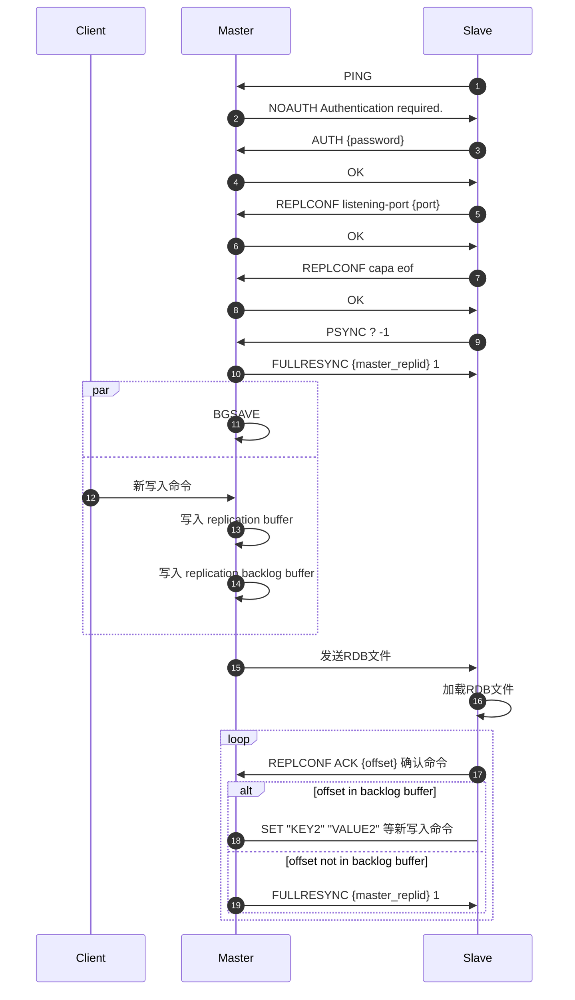
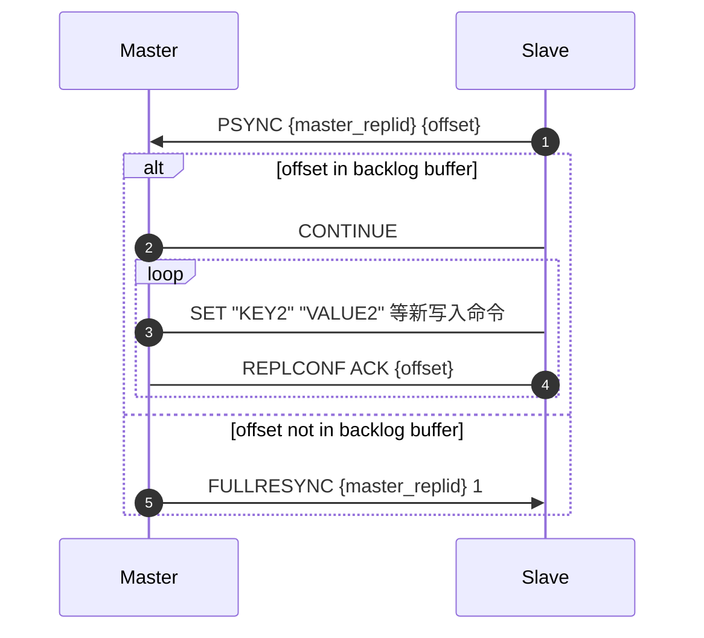
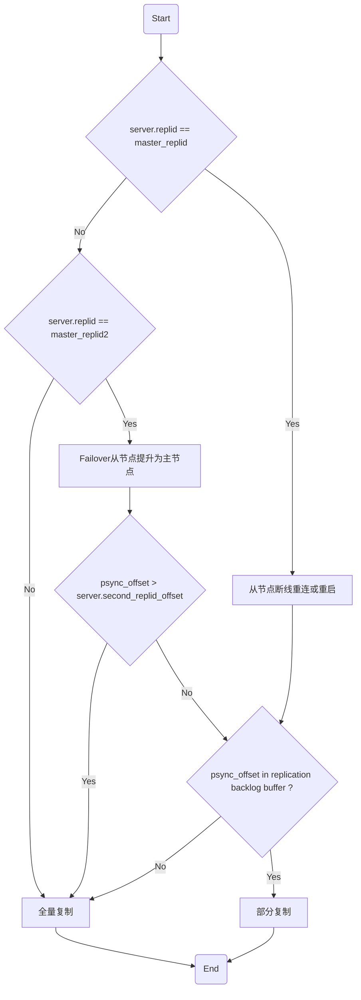

# 1 Redis 同步类型
## 1.1 全量同步


全量同步可能有以下影响：
1. Master `bgsave` 会 `fork`，可能会造成 Master 阻塞，可以通过 `latest_fork_usec` 进行监控
2. COW 写并发高可能会造成 Master 内存占用过大
3. Redis Slave 加载 RDB 时，Master 的 `client-output-buffer-limit` 增大可能造成内存占用率过高，也有可能造成溢出，导致主从连接关闭，导致全量复制失败
4. Redis 保存 RDB 会有 IO 和 CPU 消耗（压缩存储），可通过无盘复制避免
5. GB 级 RDB 文件传输可能会造成网络拥堵
## 1.2 部分同步

# 2 Redis 主从复制版本演进

## 2.1 Redis 2.8 前 `SYNC` 

## 2.2 Redis 2.8 引入 `PSYNC`

## 2.3 Redis 4.0 的改进 `PSYNC2`

Redis 2.8  `PSYNC`  部分同步有两个条件：
1. Master run id 没有改变
2. `offset` 在 `repl_backlog` 缓冲区中

其中 `run id` 在节点重启之后会生成一个新的，所以 `PSYNC` 在以下两个情况下会进行全同步：
1. Slave 节点重启后，由于 `run id` 变更导致需要进行全量同步
2. Master 节点故障切换为新的节点，则其他 Slave 都需要重新全量同步

`PSYNC2` 引入两个 Master ID 来解决这个问题：
* `master_replid`
* `master_replid2`

Slave 在关闭前，会把当前 Master 的 `replid` 和 `offset` 保存到 RDB 中，Slave 重启时，会从 RDB 中读取这个值。

`master_replid2` 通常初始化为全0，用于存储上次主节点的 `master_replid`。这意味着如果当前主节点是从另一个主节点升级而来，则 `master_replid2` 将保存那个旧主节点的 `master_replid`。

当有新的 Slave 连接到这个新的 Master 时，Slave 发送 `PSYNC {master_replid} {offset}`，新的 Master 会判断 Slave 发送过来的 `{master_replid}` 和自己保存的 `master_replid` 和 `master_replid2` 的关系，同时结合 `offset` 判读是否可以进行部分同步。

可参考[代码](https://github.com/redis/redis/blob/557e0b1c07a70af329626ff8f9ad7baf4c6f6e02/src/replication.c#L814)。



# 3 Redis 主从复制配置
## 3.1 `replica-serve-stale-data yes`

* 设置为 `yes`，副本和主服务器断连时任然可以对外提供服务，保证了可用性，但可能读取到过期数据（第一次同步时，可能读取到空数据），提高了可用性，降低了数据一致性。
* 设置为 `no`，任何访问命令客户端将收到报错 `MASTERDOWN Link with MASTER is down and replica-serve-stale-data is set to 'no'`，提高了数据一致性，降低了可用性。
	* 除了这些命令，`INFO, REPLICAOF, AUTH, SHUTDOWN, REPLCONF, ROLE, CONFIG, SUBSCRIBE,UNSUBSCRIBE, PSUBSCRIBE, PUNSUBSCRIBE, PUBLISH, PUBSUB, COMMAND, POST,HOST，LATENCY`

## 3.2 `repl-diskless-sync yes`

Redis 同步策略有两种：
* `disk`
* `socket`
全量同步时 RDB 文件传输有两种方式：
* `Disk-backed`，主进程 `fork` 子进程生成 RDB 文件后，主进程依次发送 RDB 给副本，其他副本需要等待当前传输结束
	* 分块发送
	* 非阻塞 IO
	* `sendfile` 零拷贝系统调用
* `Diskless`，主进程 `fork` 子进程直接通过 `socket` 传输给副本。可以通过配置 `repl-diskless-sync-delay 5` 设置 5 s 等待时间，等待更多的副本同步请求后并行传输

## 3.3 `repl-diskless-sync-max-replicas 0`

`repl-diskless-sync-delay` 等待期间，如果无盘同步请求达到这个配置，则直接进行传输。

## 3.4 `repl-ping-replica-period 10`

主服务器发送 `PING` 的间隔为 10 s

## 3.5 `repl-timeout 60`

设置副本超时时间为 60 s，需要比配置 `repl-ping-replica-period 10` 设置的长。
以下三种情况认为主从复制超时：
* Replica 角度下，`repl-timeout` 时间内没有收到 Master 的 RDB 数据
* Replica 角度下，`repl-timeout` 时间内没有收到 Master 的数据或者 `PING`
* Master 角度下，`repl-timeout` 时间内没有收到 Replica 的 `REPLCONF ACK {offset}` 
## 3.6 `repl-disable-tcp-nodelay no`

是否配置开启 `TCP_NODELAY`：
* 如果开启，数据包立即发送，减少延迟
* 如果关闭，开启 Nagle 算法，会合并小数据包并等待确认（ACK）或数据积累，减少网络小包数量，但增加传输延迟
Redis 默认配置为开启 `TCP_NODELAY` ，减少了延迟，但增加了带宽，适用于实时应用。如果带宽成本高且需要远距离传输（比如跨地域主从）等，可容忍一定延迟，可设置为 `yes`。

## 3.7 `repl-backlog-size 1mb`

Replica 和 Master 断连后，Master 会把新的写入命令存到 `replication backlog buffer`，这个缓冲区的大小由这个配置决定，如果 Replica 重连后 `PSYNC` 发送的 `offset` 不在这个 buffer 中，则会进行全量同步。

计算公式： $（Master 写入命令速度 \times 命令大小 - 主从传输命令速度 \times 命令大小）\times 2$

## 3.8 `repl-backlog-ttl 3600`

Master 如果没有 Replica 连接了，`repl-backlog-ttl` 秒后将释放 `backlog`。

如果设置为 0 则表示永远不释放。
## 3.9 `replica-priority 100`

用于 `Sentinel` 选主，值越低则被选主的优先级越高，默认为 100，如果为 0 表示这个节点永远不会被选为 Master。

## 3.10 `propagation-error-behavior ignore`

配置处理命令和读取持久化的 AOF 文件时如果遇到错误的行为：
* ignore，表示忽略，继续处理后续。可能导致主从数据不一致，为了兼容旧版本的功能
* panic，立刻终止报错，人工介入修复
* panic-on-replicas，只有副本遇到错误时才会终止报错

## 3.11 `replica-ignore-disk-write-errors no`

如果从 Master 同步的命令无法持久化到副本磁盘，则直接崩溃，一般不建议修改。如果为了版本兼容可以修改为 `yes`。

## 3.12 `replica-announced yes`

如果设置为 `no` 则该节点会忽略 `sentinel replicas <master>` 命令，且不会暴露给 Redis sentinel 的客户端。

哪怕设置为 `no`，该节点也是有可能被选为 Master，可设置 `replica-priority` 为 0 避免该节点被选为 Master。

## 3.13 `min-replicas-to-write 3` 和 `min-replicas-max-lag 10`

配置 Master 接受写命令的限制：
* 最小在线 Replica 数为 3
* Replica 最大延迟为 10 s

这两个配置可以显著降低主从数据不一致的问题。设置任何一个值为 0 可以关闭限制，默认为关闭。

## 3.14 `replica-announce-ip` 和 `replica-announce-port`

用于 NAT 网络中配置 Replica 的真正 IP 和端口，防止 Master 无法访问 Replica。


# 4 监控
## 4.1 Master 和 Replica 的同步进度监控

* `master_repl_offset`，Master节点 offset
* `slave_repl_offset`，Replica 节点 offset
* `slave_read_repl_offset`，Replica 节点从网络读取 offset

根据这三个值可以计算延迟：
* Replica 网络延迟：`master_repl_offset - slave_read_repl_offset`。    
- Repica 处理延迟：`slave_read_repl_offset - slave_repl_offset`。    
- **总延迟**：`master_repl_offset - slave_repl_offset`。

# 5 Redis Master 和 Replica 如何处理过期数据？

# 6 Redis 主从同步策略有哪些？各自有什么优劣势？

# 7 Redis 场景的拓扑结构有哪些？

## 7.1 复制拓扑结构

## 7.2 星形拓扑结构

## 7.3 树状拓扑结构

# 8 Redis 主从数据不一致该怎么办？

# 9 Redis 如何避免主从复制风暴？


相关配置
# 10 Reference
* [Redis replication \| Docs](https://redis.io/docs/latest/operate/oss_and_stack/management/replication/)
* [06 \| 数据同步：主从库如何实现数据一致？-Redis核心技术与实战-极客时间](https://time.geekbang.org/column/article/272852)
* [32 \| Redis主从同步与故障切换，有哪些坑？-Redis核心技术与实战-极客时间](https://time.geekbang.org/column/article/303247)
* [33 \| 脑裂：一次奇怪的数据丢失-Redis核心技术与实战-极客时间](https://time.geekbang.org/column/article/303568)
* [INFO \| Docs](https://redis.io/docs/latest/commands/info/)
* [Redis4.0新特性(三)-PSYNC2-阿里云开发者社区](https://developer.aliyun.com/article/245528)
* [Redis 主从复制 psync1 和 psync2 的区别在分布式环境中，数据副本 (Replica) 和复制 (Re - 掘金](https://juejin.cn/post/6844903838567104520)
* [Redis 主从复制（Replication） - buttercup - 博客园](https://www.cnblogs.com/buttercup/p/14017314.html) 
* [Redis4.0 主从复制(PSYN2.0) - lshs - 博客园](https://www.cnblogs.com/lshs/p/6195257.html)
* [redis主从复制策略的原理：主从节点间如何同步数据？\_redis主从复制时主节点新数据-CSDN博客](https://blog.csdn.net/virusos/article/details/130915836)
* [\[redis学习笔记\]redis新特性--psync2 \| LuoMing's Blog](https://luoming1224.github.io/2018/11/20/[redis%E5%AD%A6%E4%B9%A0%E7%AC%94%E8%AE%B0]redis4.0%E6%96%B0%E7%89%B9%E6%80%A7-psync2/)
* [Redis进阶篇05 — 复制技术（二）Redis主从复制 – Rocky Linux](https://www.rockylinux.cn/notes/redis-advanced-chapter-05-replication-technology-ii.html)
* [Redis进阶篇06 — 复制技术（三）有关Redis复制的配置参数 – Rocky Linux](https://www.rockylinux.cn/notes/redis-advanced-chapter-06-replication-technology-3.html)
* [Redis进阶篇07 — 复制技术（四）replica 与 sub-replica – Rocky Linux](https://www.rockylinux.cn/notes/redis-advanced-chapter-07-copy-technology-4-copy-and-sub.html)
* [Redis进阶篇09 — 集群 – Rocky Linux](https://www.rockylinux.cn/notes/redis-advanced-edition-09-cluster.html)


```
 4. **配置与管理实践**
   - 4.1 主从配置详解
     - 4.1.1 redis.conf 关键参数
       - replicaof
       - masterauth
       - repl-timeout
       - repl-backlog-size
     - 4.1.2 运行时配置命令
       - SLAVEOF
       - REPLICAOF
       - CONFIG SET
   - 4.2 状态监控
     - 4.2.1 INFO replication 输出解析
     - 4.2.2 ROLE 命令深度解读
     - 4.2.3 关键监控指标
       - master_repl_offset
       - slave_repl_offset
       - lag 计算原理
   - 4.3 故障处理
     - 4.3.1 网络中断恢复策略
     - 4.3.2 主节点切换场景处理
     - 4.3.3 数据一致性校验方法
   
       - 6.1 同步性能瓶颈分析
   - 6.2 关键参数调优
     - repl-backlog-size
     - repl-ping-slave-period
     - client-output-buffer-limit
   - 6.3 持久化策略选择
     - RDB vs AOF 对复制的影响
     - 混合持久化配置
   - 6.4 网络优化策略
     - 带宽控制
     - 压缩传输实践
     
7. **异常场景处理**
   - 7.1 主从数据不一致检测
   - 7.2 脑裂问题处理
   - 7.3 复制风暴预防
   - 7.4 大Key同步优化
   - 7.5 版本兼容性问题
```