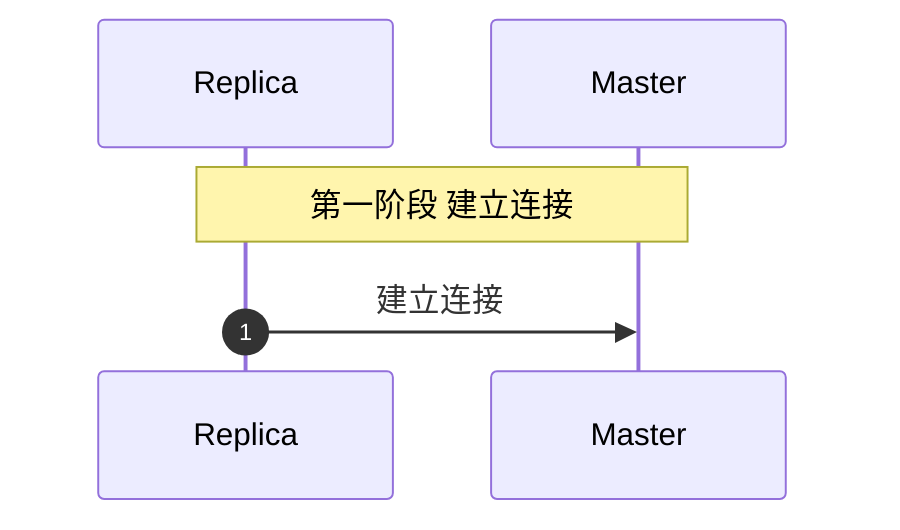
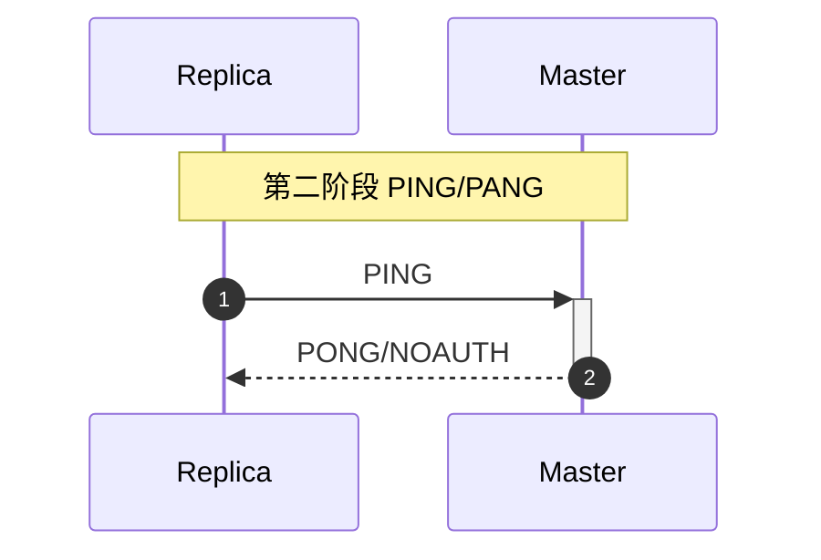
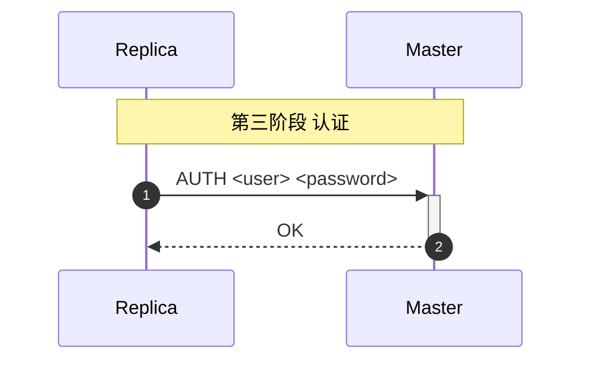
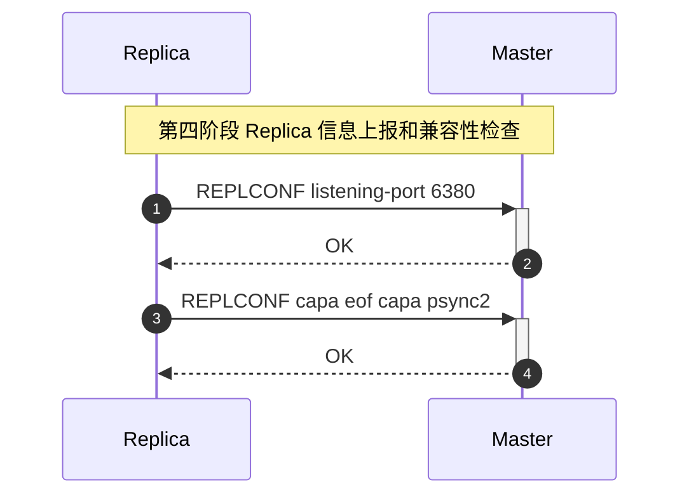
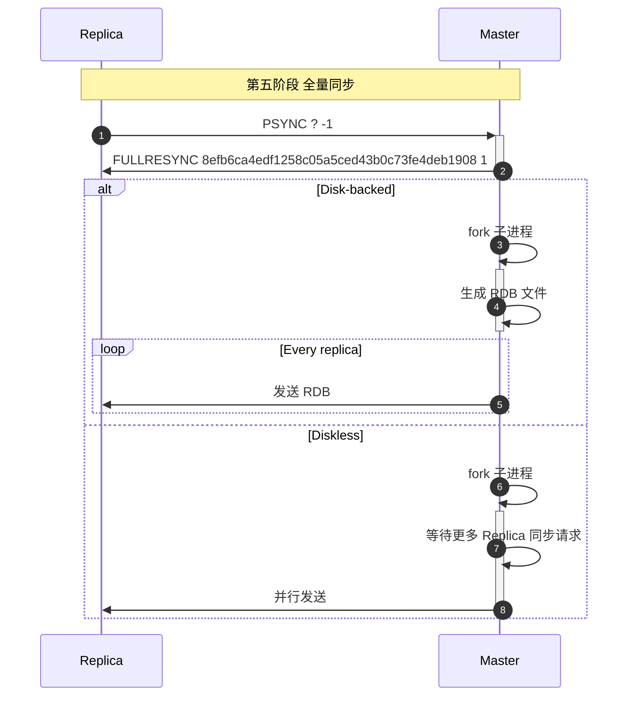
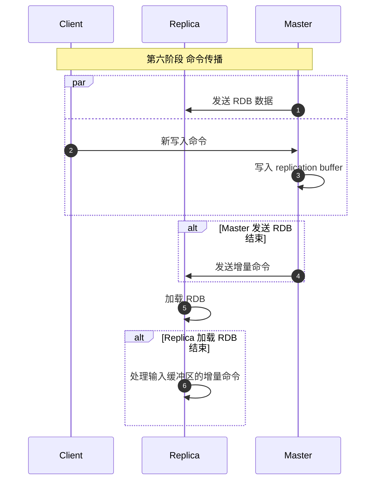
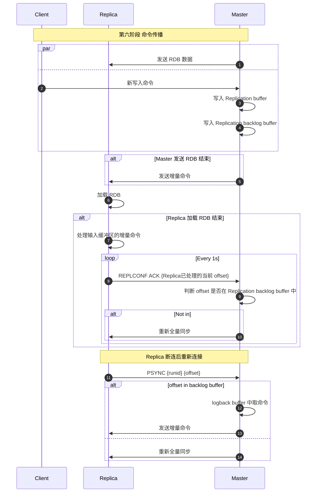
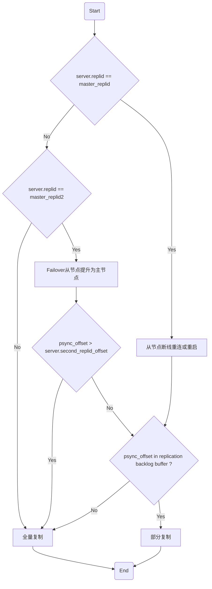

# 1 主从同步流程和版本演变
## 1.1 配置 Master
Replica 有三种方式配置 Master 进行同步：
```c
# 1. 直接命令执行
replicaof <masterip> <masterport>

# 2. 配置文件中进行配置
replicaof <masterip> <masterport>

# 3. 启动命令参数
--replicaof <masterip> <masterport>
```
## 1.2 建立连接
Replica 建立与 Master 的 TCP 连接，并保持长连接。

## 1.3 握手验证

## 1.4 认证阶段
如果 Master 配置了认证，则需要在 Replica 配置中配置 Master 的认证信息，
```properties
# If the master is password protected (using the "requirepass" configuration
# directive below) it is possible to tell the replica to authenticate before
# starting the replication synchronization process, otherwise the master will
# refuse the replica request.
#
masterauth <master-password>
#
# However this is not enough if you are using Redis ACLs (for Redis version
# 6 or greater), and the default user is not capable of running the PSYNC
# command and/or other commands needed for replication. In this case it's
# better to configure a special user to use with replication, and specify the
# masteruser configuration as such:
#
masteruser <username>
```


## 1.5 Replica 信息上报和兼容性检查
Master 需要明确 Replicas 的 IP 地址和端口号，比如在 Master 执行 `INFO REPLICATION`，在客户端执行了 `CLIENT LIST` 命令可以获取正确的 IP 和端口号。

在 NAT 网络下需要配置：
```properties
replica-announce-ip 5.5.5.5
replica-announce-port 1234
```

TCP 握手阶段 Master 已经得知了 Replica 的 IP 地址，所以需要额外上报端口号 `REPLCONF listening-port <port>`，如果配置了 NAT，则上报 NAT 端口，且要上报 IP 地址 `REPLCONF ip-address <ip>`。

Replica 还要检查 Master 的兼容性 `REPLCONF capa eof` `REPLCONF capa psync2` 


## 1.6 全量同步阶段

### 1.6.1 全量同步流程
Master 主进程 `fork` 子进程生成 RDB 传输给 Replica，RDB 传输有两种策略：
1. Disk-backed
2. Diskless
详情可参考 [Redis 主从同步全量同步策略有哪些？各自有什么优劣势？](Redis%20主从同步全量同步策略有哪些？各自有什么优劣势？.md)

### 1.6.2 全量同步可能的影响
1. Master `bgsave` 会 `fork`，可能会造成 Master 阻塞，可以通过 `latest_fork_usec` 进行监控
2. COW 写并发高可能会造成 Master 内存占用过大
3. Redis Slave 加载 RDB 时，Master 的 `client-output-buffer-limit` 增大可能造成内存占用率过高，也有可能造成溢出，导致主从连接关闭，导致全量复制失败
4. Redis 保存 RDB 会有 IO 和 CPU 消耗（压缩存储），可通过无盘复制避免
5. GB 级 RDB 文件传输可能会造成网络拥堵
## 1.7 命令传播阶段
Redis 主从同步时期，如果有客户端写入的新的命令，Master 会将其写入 Replication Buffer，当 Maser 完成 RDB 传输后，将发送 Replication Buffer 中的命令给 Replica，Replica 会暂存在缓冲中知道 RDB 加载完成后开始处理增量命令。



## 1.8 版本演进

### 1.8.1 Redis 2.8 版本之前 `SYNC`

不具备部分同步的能力，当 Replica 断开连接后，再次重连需要重新全量同步。

### 1.8.2 Redis 2.8 版本 `PSYNC`

命令格式：`PSYNC replicationid offset`

`PSYNC` 通过新增一个 Replication backlog buffer 环形缓冲区来实现部分重同步，当 Master 生成 RDB 期间，新增写入命令同时写入 Replication buffer 和 Replication backlog buffer。

`PSYNC`  在以下四种情况都会导致主从全量同步：
* Master 重启后，自身 `runid` 会重新生成，导致 Replica 发送命令 `PSYNC {runid} {offset}` 中的 `runid` 与主节点不一致，判断为全量同步
* Replica 只在内存中保存了 Master 的 `runid`，Replica 重启后 `runid` 丢失，进行全量同步
*  Replica 掉线时间过久，offset 不在 Master 的 Replication backlog buffer 中了，进行全量同步
* Replica 消费增量命令过慢，`REPLCONF ACK {offset}` 不在 Master 的 Replication backlog buffer 中，进行全量同步 
* Replica 被提升为 New Master 后，其他的旧 Replica 将全量同步 New Master 数据


### 1.8.3 Redis 4.0 版本 `PSYNC2`

为了解决 Master 和 Replica 重启导致的全量同步，Redis 在 4.0 版本中引入了 `replication id` 来代替 `runid`，两者的具体含义参考 [Redis 的 run id 和 replication id](Redis%20的%20run%20id%20和%20replication%20id.md)。 Replica 实例在正常关闭（比如 `shutdown` 和 `save`）时，会将 `replicationg id` 和 `offset` 写入到 RDB 文件中，Replica 实例重启后会从 RDB 文件中重新读取 `replication id` 和 `offset` 尝试部分同步。

`PSYNC` 如果 `failover` 后，假设 Replica A 被提升为新的 Master，其他 Replica 需要重新全量同步 A 的数据，因为 Replica X 发送的 `PSYNC old-master-id old-offset` 不匹 Replica A 的 `replication id`。

`PSYNC2` 进行了优化，如果发生了主从切换，要提升为 Master 的 Replica 会将自己之前的 `replication id` 和 `offset` 保存在 `master_replid2` 和 `second_repl_offset` 中。当 Replica 发起同步请求时，如果 Master 判断 Replica 提供的 Replication id 和自己的 `master_replid2` 和 `second_repl_offset` 都不相等，或者
* 等于 `master_replid` 但 offset 超过了 `master_repl_offset`
* 等于 `master_replid2` 但 offset 超过了 `second_repl_offset`
都会进行全量同步，否则进行部分同步。

可参考[代码](https://github.com/redis/redis/blob/557e0b1c07a70af329626ff8f9ad7baf4c6f6e02/src/replication.c#L814)。



### 1.8.4 Redis 7.0 的优化

Replication buffer 中的内容和 Replication backlog buffer 的内容是一致的，且如果有多个从库，会有多个 Replication buffer，会占用主库的大量内存，百度对 Redis 7.0 贡献了共享缓冲区的功能，多个从库的 Replication buffer 和 Replication backlog buffer 共享。

# 2 Reference
* [Redis主从复制原理及其演变 \| 闫金钢的Blog](https://yanjingang.com/blog/?p=5861#Redis1)
* [Redis主从复制演进史与奇思妙想](https://bugwz.com/2022/10/01/redis-replication)
* [redis系列--主从复制以及redis复制演进 - W-D - 博客园](https://www.cnblogs.com/wdliu/p/9407179.html)
* [Redis 主从复制演进历程与百度实践](https://mp.weixin.qq.com/s/N8kkF2zVZfRK2tSkuLJb7A)
* [Redis 主从复制演进历程与百度实践-极客时间](https://time.geekbang.org/qconplus/detail/100110470)
* [Redis4.0新特性(三)-PSYNC2-阿里云开发者社区](https://developer.aliyun.com/article/245528)
* [Redis 主从复制 psync1 和 psync2 的区别在分布式环境中，数据副本 (Replica) 和复制 (Re - 掘金](https://juejin.cn/post/6844903838567104520)
* [Redis 主从复制（Replication） - buttercup - 博客园](https://www.cnblogs.com/buttercup/p/14017314.html) 
* [Redis4.0 主从复制(PSYN2.0) - lshs - 博客园](https://www.cnblogs.com/lshs/p/6195257.html)
* [\[redis学习笔记\]redis新特性--psync2 \| LuoMing's Blog](https://luoming1224.github.io/2018/11/20/[redis%E5%AD%A6%E4%B9%A0%E7%AC%94%E8%AE%B0]redis4.0%E6%96%B0%E7%89%B9%E6%80%A7-psync2/)