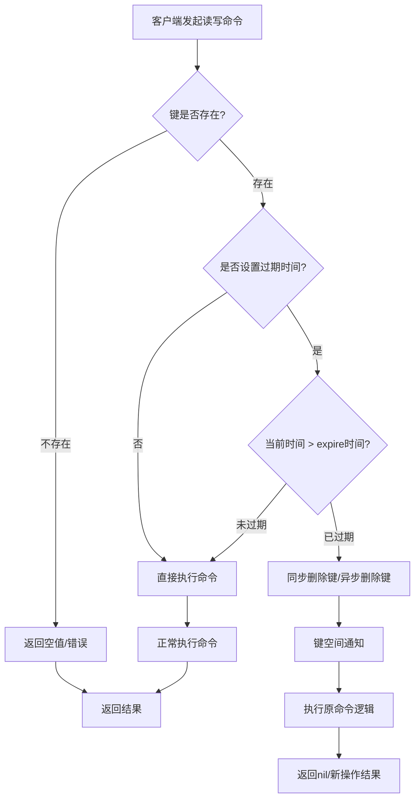

---
title:
  Redis 过期数据处理机制
tags:
  - permanent-note
date:
  2025-03-10
time:
  19:33
aliases:
done: false
---
# 常见过期删除策略


| 策略   | 简介                            | 优点                             | 缺点                               |
| ---- | ----------------------------- | ------------------------------ | -------------------------------- |
| 定时删除 | 设置过期时间注册定时任务，过期后自动删除          | 能够及时删除过期数据                     | 过期数据过多时 CPU 占用可能过多               |
| 定期删除 | 每隔一段时间取一批并检查删除过期数据            | 占用 CPU 比定时删除少，也能删除部分过期数据降低内存占用 | 1. 不如定时删除及时<br>2. 不如惰性删除占用 CPU 低 |
| 惰性删除 | 不主动删除，访问到 Key 时判断是否过期，如果过期则删除 | 占用 CPU 最少                      | 如果过期 Key 没有被访问到则会一直在内存中          |

# Redis 过期删除策略

Redis 采用了定期删除+惰性删除两种方式的结合。


## Redis 惰性删除

当访问到 Key 时进行判断，判断 Key 是否存在于过期字典中，且判断是否过期，如果过期则删除，如果没有则返回值。

其中的删除操作跟 [[Redis 延迟删除机制]] 的 `lazyfree-lazy-expire no` 配置有关。



## Redis 定期删除

Redis 每隔一段时间取一批数据检查是否过期进行删除：
* 隔多久：`hz` 配置决定频率，`dynamic-hz yes` 配置决定动态 `hz`，通过计算得出
* 取多少：默认一次取出 20 个样本进行过期数据判断
* 如果采样后过期数据大于 25%（默认配置 `active-expire-effort 1`），表示过期数据可能占比已经很大了，需要尽可能多的删除过期数据，会再次执行删除

`active-expire-effort` 配置：

```properties
# Redis reclaims expired keys in two ways: upon access when those keys are
# found to be expired, and also in background, in what is called the
# "active expire key". The key space is slowly and interactively scanned
# looking for expired keys to reclaim, so that it is possible to free memory
# of keys that are expired and will never be accessed again in a short time.
#
# The default effort of the expire cycle will try to avoid having more than
# ten percent of expired keys still in memory, and will try to avoid consuming
# more than 25% of total memory and to add latency to the system. However
# it is possible to increase the expire "effort" that is normally set to
# "1", to a greater value, up to the value "10". At its maximum value the
# system will use more CPU, longer cycles (and technically may introduce
# more latency), and will tolerate less already expired keys still present
# in the system. It's a tradeoff between memory, CPU and latency.
#
# active-expire-effort 1
```

# Reference