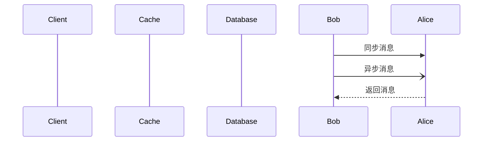
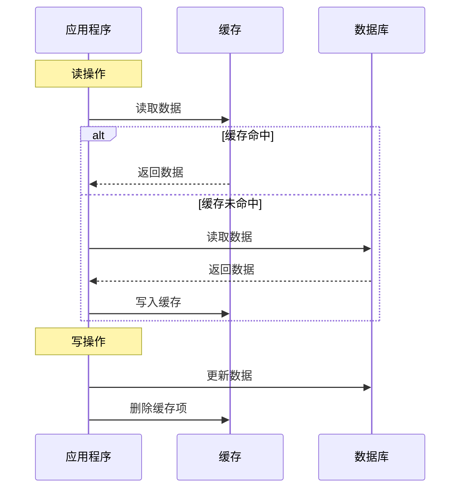
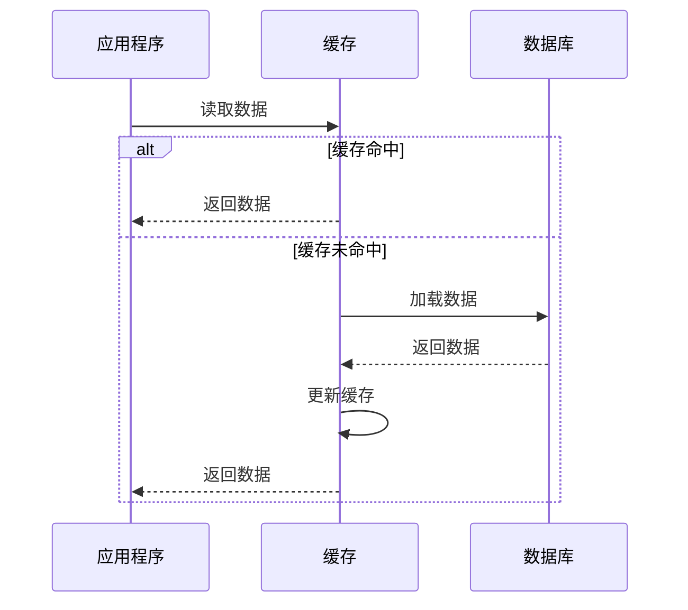

# 1 缓存模式

## 旁路缓存 `Cache Aside`

应用直接管理缓存。读时先查缓存，未命中则从数据库加载并写入缓存；写时直接更新数据库，缓存可选择删除或后续延迟更新。

## 读穿透 Read Through

当缓存中没有数据时，缓存会代替你去数据库里面把数据加载出来，并且缓存起来，比如 [Apache Ignite](https://github.com/apache/ignite).

## 1.1 Cache-Aside（旁路缓存）
- 原理：应用直接管理缓存。读时先查缓存，未命中则从数据库加载并写入缓存；写时直接更新数据库，缓存可选择删除或后续延迟更新。
- 优点：灵活，缓存与数据库解耦。
- 缺点：缓存未命中时延迟高，需处理并发写入问题。
- 场景：读多写少（如电商商品详情页）。

## 1.2 Read-Through（读穿透）
- 原理：缓存作为独立服务，应用只读缓存。若缓存未命中，缓存层自动从数据库加载数据。
- 优点：代码简洁，缓存逻辑对应用透明。
- 缺点：需缓存服务支持此模式（如 Redis 需配合额外逻辑）。
- 场景：缓存服务独立（如使用分布式缓存）。

## 1.3 Write-Through（写穿透）
- 原理：写入时同时更新缓存和数据库，保证二者强一致。
- 优点：数据一致性高。
- 缺点：写入延迟较高（需双写）。
- 场景：强一致性要求（如金融交易系统）。

---

## 1.4 Write-Behind（异步回写）
- 原理：应用先写缓存，缓存层异步批量写入数据库。
- 优点：写入性能极高。
- 缺点：存在数据丢失风险（缓存故障时）。
- 场景：高写入且容忍延迟（如日志采集、消息队列）。

---

## 1.5 Write-Around（绕写）
- 原理：写操作直接到数据库，缓存不更新，仅读时加载。
- 优点：避免频繁写入缓存。
- 缺点：读缓存命中率可能低。
- 场景：写多读少（如实时监控数据）。

---

## 1.6 Refresh-Ahead（预刷新）
- 原理：缓存过期前主动刷新热点数据。
- 优点：减少用户等待时间。
- 缺点：预测不准可能导致资源浪费。
- 场景：高热度数据（如新闻首页）。

---

## 1.7 选择依据
- 一致性需求：强一致选 Write-Through，弱一致选 Write-Behind。
- 读写比例：读多选 Cache-Aside，写多选 Write-Around。
- 性能要求：高吞吐写入用 Write-Behind，低延迟读取用 Refresh-Ahead。

通过结合业务场景选择合适的模式，可显著提升系统性能与可靠性。

# 2 Reference
* [25 \| 缓存异常（上）：如何解决缓存和数据库的数据不一致问题？-Redis核心技术与实战-极客时间](https://time.geekbang.org/column/article/295812)
* [11 \| MySQL如何应对高并发（一）：使用缓存保护MySQL-后端存储实战课-极客时间](https://time.geekbang.org/column/article/213230)
* [17 \| 大厂都是怎么做MySQL to Redis同步的?-后端存储实战课-极客时间](https://time.geekbang.org/column/article/217593)
* [33｜缓存模式：缓存模式能不能解决缓存一致性问题？-后端工程师的高阶面经-极客时间](https://time.geekbang.org/column/article/692719)
* [34｜缓存一致性问题：高并发服务如何保证缓存一致性？-后端工程师的高阶面经-极客时间](https://time.geekbang.org/column/article/696599)
* [缓存和数据库一致性问题，看这篇就够了](https://mp.weixin.qq.com/s/4W7vmICGx6a_WX701zxgPQ)
* [13 \| 缓存的使用姿势（一）：如何选择缓存的读写策略？-高并发系统设计40问-极客时间](https://time.geekbang.org/column/article/150881)