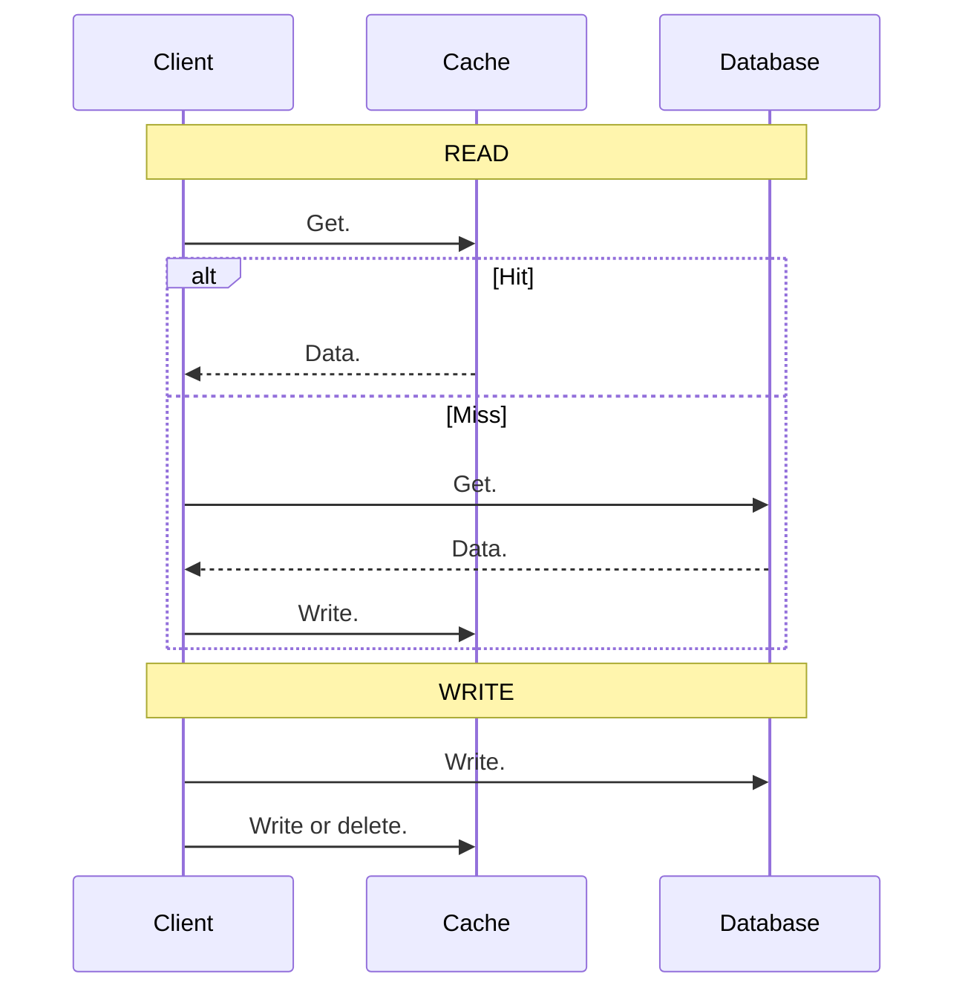
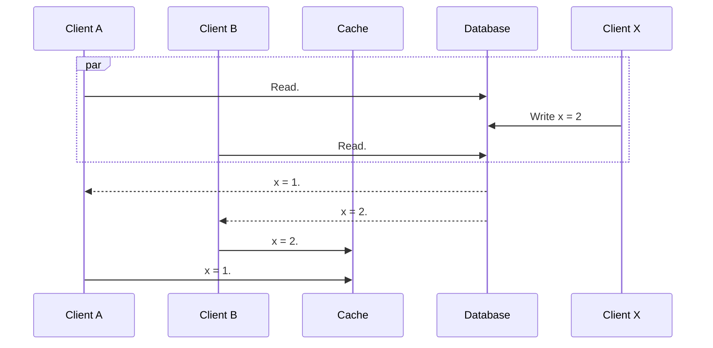
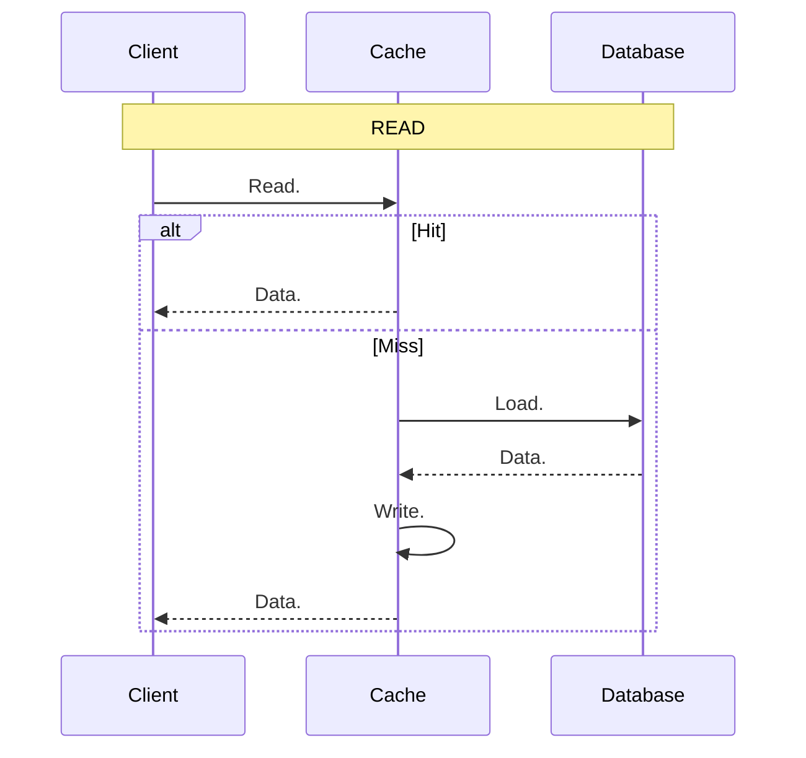
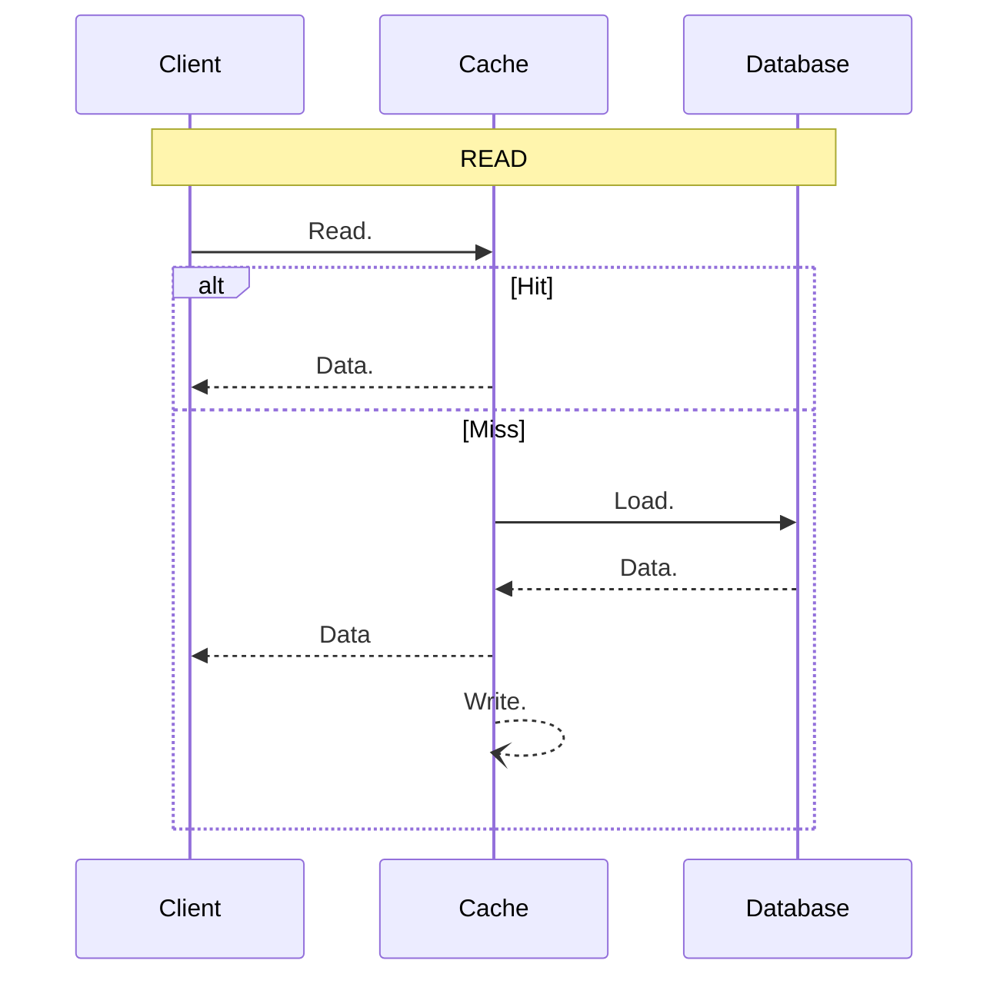
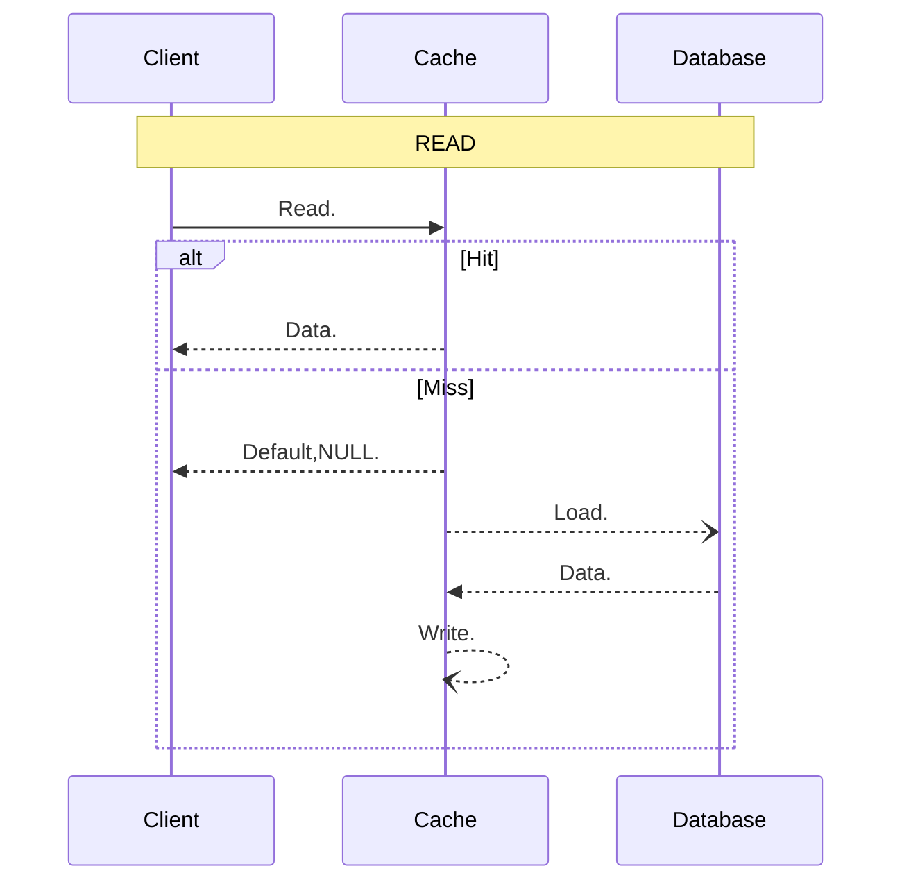
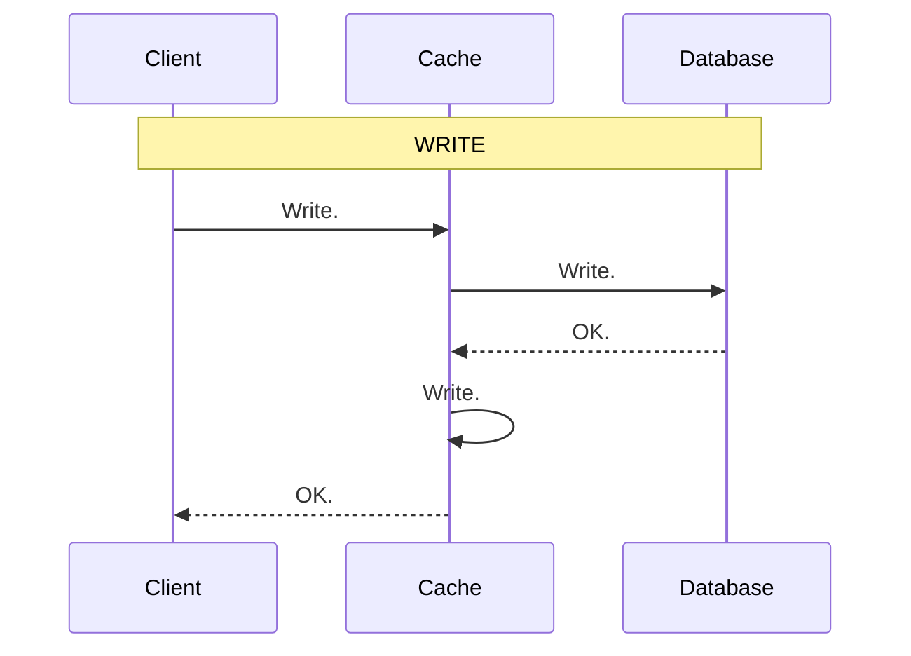
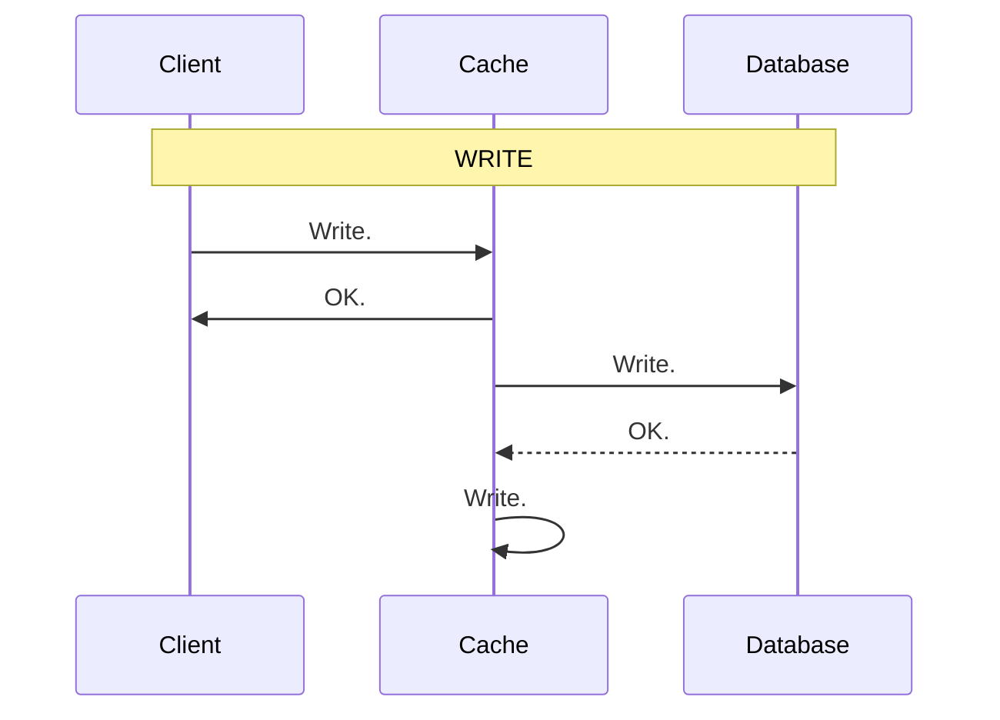
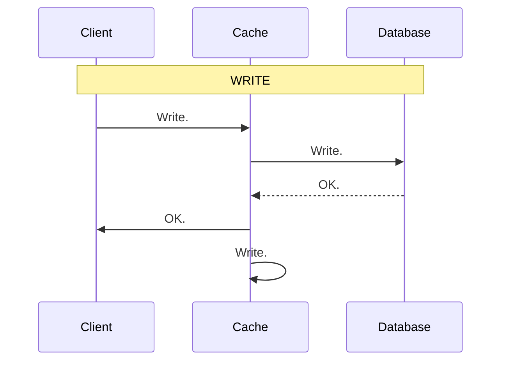
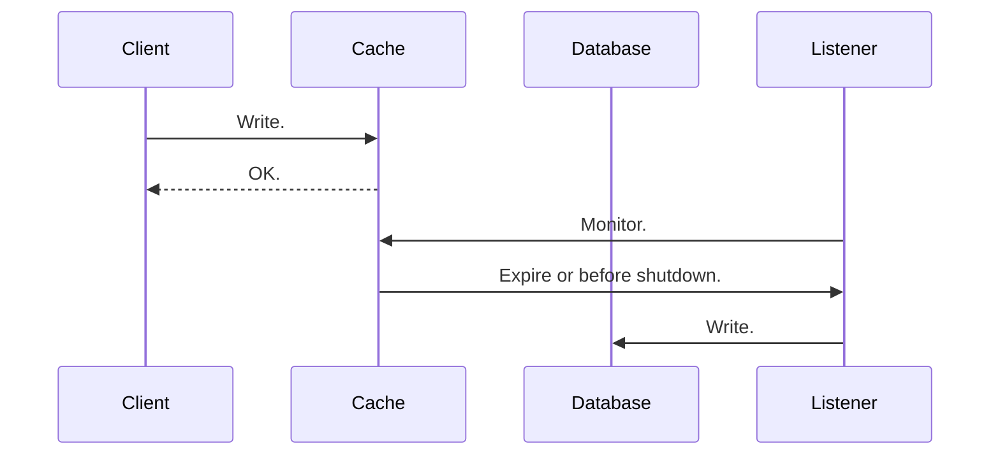

# 1 缓存模式

## 1.1 旁路缓存 `Cache Aside`

 旁路缓存作为和数据库类似的数据源，完全由客户端控制怎么读取、写入缓存。
 * 读：先查缓存，未命中则从数据库 Load 并写入缓存
 * 写：先写数据库，再选择删除缓存或者更新缓存

旁路缓存并不会解决数据一致性问题，如果选择更新缓存，则会有时序问题导致数据不一致。



### 1.1.1 处理写请求时选写缓存还是删除缓存？

使用删除缓存更好一点，因为写缓存可能会出现写写覆盖问题。
### 1.1.2 处理读请求时如果没有在缓存中获取到数据怎么办？

没有获取到数据时，需要重建缓存，重建缓存可能存在不一致性（概率很小）：



但如果是热点数据，则会有缓存击穿的风险，导致 DB 压力过大。


先加锁，再从 DB load 到 Cache，获取到锁后都会执行 load

```java
lock();
	load();
unlock();
```

只有一个进程会 Load DB to cache

```java
lock();
	if (exist()) {
		return
	} else {
		load();
	}
unlock();
```

为了减少锁竞争压力，单机中通过 single flight 竞争出一个优胜者在与集群竞争锁，能够把大量的请求锁竞争减少为节点的竞争。


## 1.2 读穿透 Read Through

当缓存中没有数据时，缓存会去数据库里面把数据加载出来，并且缓存起来，而不是应用程序去加载数据，比如 [Apache Ignite](https://github.com/apache/ignite).



读穿透从 DB 读取到数据后也可以异步写入缓存，直接返回数据给客户端。



甚至加载 DB 也可以异步化，但客户端会读取到错误的值，具体选用哪一种需要抉择。


## 1.3 写穿透 Write Through

客户端只需要写入缓存，缓存会去更新数据库。


缓存可以在客户端写入后直接返回，异步化数据库写入和缓存写入，如果缓存宕机，则有可能丢失数据。

可以保底数据库写入成功后异步写入缓存。

## 1.4 回写 Write Back

 写入数据时，只操作缓存，当缓存过期失效时，数据才会被刷新到数据库，如果数据还在缓存中，缓存系统崩溃可能会导致数据丢失，如果使用的是 Redis，且有较高程度的持久化机制，不考虑系统宕机导致的数据丢失，则 Write Back 模式基本能解决数据不一致问题。



读数据库时，如果不存在从 DB 加载时可能会造成不一致，但可以使用 `SETNX` 来避免这种情况，如果回写失败了则直接读取缓存。这种模式对缓存一致性有了很大程度的保障。

## 1.5 Refresh Ahead

读请求正常从缓存读，如果读取不到，先读取数据库，再加载到缓存中。
写请求只写 DB，使用 CDC 比如 Cannal 订阅变更，自动写入缓存

## 1.6 Singleflight

当读取缓存数据失败，需要从 DB Load 时，如果是热点数据大量请求会落到 DB 读取数据后更新缓存。Single flight 模式下只有一个线程去 Load 数据库数据到缓存中。


## 1.7 删除缓存

当写入 DB 后，不选择更新缓存而是删除缓存，主要是为了避免写写覆盖的问题。但依然还有一致性问题，当删除缓存后，有脏数据写入请求，因此也可以使用延迟双删，减少不一致的可能性。


# 2 Reference
* [25 \| 缓存异常（上）：如何解决缓存和数据库的数据不一致问题？-Redis核心技术与实战-极客时间](https://time.geekbang.org/column/article/295812)
* [11 \| MySQL如何应对高并发（一）：使用缓存保护MySQL-后端存储实战课-极客时间](https://time.geekbang.org/column/article/213230)
* [17 \| 大厂都是怎么做MySQL to Redis同步的?-后端存储实战课-极客时间](https://time.geekbang.org/column/article/217593)
* [33｜缓存模式：缓存模式能不能解决缓存一致性问题？-后端工程师的高阶面经-极客时间](https://time.geekbang.org/column/article/692719)
* [34｜缓存一致性问题：高并发服务如何保证缓存一致性？-后端工程师的高阶面经-极客时间](https://time.geekbang.org/column/article/696599)
* [缓存和数据库一致性问题，看这篇就够了](https://mp.weixin.qq.com/s/4W7vmICGx6a_WX701zxgPQ)
* [13 \| 缓存的使用姿势（一）：如何选择缓存的读写策略？-高并发系统设计40问-极客时间](https://time.geekbang.org/column/article/150881)
* [缓解缓存击穿的大杀器之---singleflight深入浅出singleflight简单介绍 singlefight直译 - 掘金](https://juejin.cn/post/7278112119353704502)