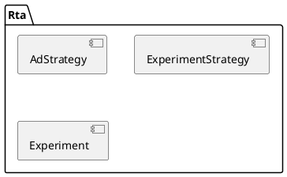
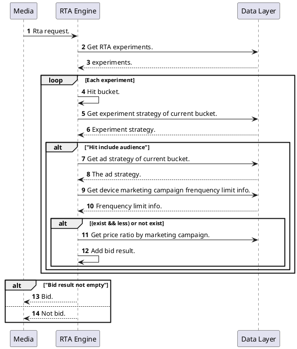
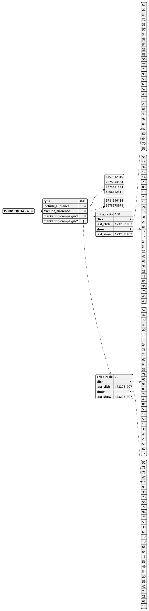

# 1 Ubiquitous language

| Bounded Context | 中文名         | 英文名                                   | 解释                                               |
| --------------- | ----------- | ------------------------------------- | ------------------------------------------------ |
|                 | RTA 广告策略    | RTA Ad Strategy                       | 用于回复给媒体的 RTA 广告策略，绑定多个广告媒体账号或者广告单元               |
|                 | RTA 实验策略    | RTA Experiment Strategy               | RTA 实验策略，包括多项实验策略配置项，比如开启人群包（定向和排除）、开启频控、开启动态出价等 |
|                 | RTA 实验策略配置项 | RTA Experiment Strategy Configuration | RTA 实验策略的配置项                                     |
|                 | RTA ID      | RTA ID                                | 用于快手媒体的线下约定的特有 ID，用于 RTA广告策略的创建和绑定               |
|                 | 人群包         | Custome Audience                      | 包含设备号用于定向或者排除                                    |
|                 | 频次控制        | Frequency Limit                       | 可以控制广告用户点击、展示在设定窗口大小下的最大点击、观看次数                  |

# 2 Event Storming

[RTA-event-storming.excelidraw](RTA-event-storming.excelidraw.md)
# 3 Domain Design
## 3.1 Context Map

## 3.2 UML

```plantuml
@startuml
package "AdStrategy Aggregate" {
	class "AdStrategy" {
		-id:long
		-name:String
		-media:MediaTypeEnum
		-marketingCampaign:int
		-adAccounts:List<AdAccount>
	}
	
	enum MediaTypeEnum {
		TENCENT
		OCEAN_ENGINE
		KUAI_SHOU
	}
	
	class "AdAccount" {
		-id:long
		-adGroups:List<AdGroup>
	}
	
	class "AdGroup" {
		-id:long
	}
	
	class "AdStrategyDomainService" {
		+void bind(AdStrategy adStrategy, AdAccount adAccount)
		+void unbind(AdStrategy adStrategy, AdAccount adAccount)
	}

	AdStrategy o-- MediaTypeEnum
	AdStrategy "1" o-- "0..*" AdAccount
	AdAccount "1" o-- "0..*" AdGroup
}


package "ExperimentStrategy Aggregate" {
	class "ExperimentStrategy" {
		-id:long
		-name:String
		-customAudience:CustomAudience
		-frequencyLimit:FrequencyLimit
		-dynamicBid:DynamicBid
	}
	
	class "CustomAudience" {
		-switchOn:bool
		-includeIds:List<String>
		-excludeIds:List<String>
		+boolean isMatchInclude(List<String> includeIds)
		+boolean isMatchExclude(List<String> excludeIds)
	}
	
	class "FrequencyLimit" {
		-switchOn:bool
		-target:FrenquencyLimitTargetEnum
		-period:int
		-maxLimit:int
		+boolean isWithMaxLimit(long lastCountTimestamp, List<Integer> counts)
	}
	
	enum "FrenquencyLimitTargetEnum" {
		CLICK
		SHOW
	}
	
	class "DynamicBid" {
		-switchOn:bool
		-bidRatio:double
	}

	
	ExperimentStrategy o-- CustomAudience
	ExperimentStrategy "1" o-- "0..1" FrequencyLimit
	ExperimentStrategy "1" o-- "0..1" DynamicBid
	FrequencyLimit o-- FrenquencyLimitTargetEnum
}

package "Experiment Aggregate" {
	class "Experiment" {
		-id:int
		-name:String
		-marketingGoal:MarketingGoalEnum
		-controlGroup:ControlGroup
		-experimentalGroups:List<ExperimentalGroup>
	}
	
	enum "MarketingGoalEnum" {
		CUSTOM_ACQUISTION:拉新
		CUSTOM_REACTIVATION:拉活
	}
	
	class "ExperimentalUnit" {
		-buckets:List<Integer>
		-adStrategyIds:List<Long>
		-experimentStrategyId:Long
	}
	
	class "ControlGroup" extends "ExperimentalUnit"{

	}
	
	class "ExperimentalGroup" extends "ExperimentalUnit"{
		
	}
	
	Experiment o-- MarketingGoalEnum
	Experiment o-- ControlGroup
	Experiment "1" o-- "0..*" ExperimentalGroup
	
	class "ExperimentDomainService" {
		List<ExperimentalUnit> hit(Short bucket);
	}
}
@enduml
```

## 3.3 Core Sequence

# 4 API Design

# 5 Detail Design

## 5.1 UML

## 5.2 Sequence (No need for simple logic)

## 5.3 Database

## 5.4 Data Structure

### 5.4.1 Device cache data structure

# 6 References