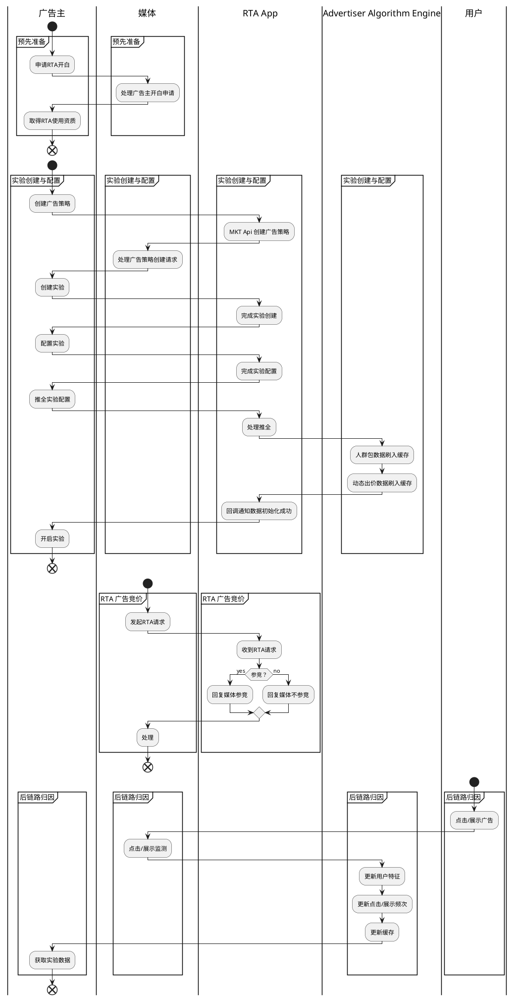

```plantuml
@startuml


|广告主|
start
partition 预先准备 {
	:申请RTA开白;
	|媒体|
	:处理广告主开白申请;
	|广告主|
	:取得RTA使用资质;
}
end


|广告主|
start
partition 实验创建与配置 {
	:创建广告策略;
	|RTA App|
	:MKT Api 创建广告策略;
	|媒体|
	:处理广告策略创建请求;
	|广告主|
	:创建实验;
	|RTA App|
	:完成实验创建;
	|广告主|
	:配置实验;
	|RTA App|
	:完成实验配置;
	|广告主|
	:推全实验配置;
	|RTA App|
	:处理推全;
	|Advertiser Algorithm Engine|
	:人群包数据刷入缓存;
	:动态出价数据刷入缓存;
	|RTA App|
	:回调通知数据初始化成功;
	|广告主|
	:开启实验;
}
end

|媒体|
start
partition RTA 广告竞价 {
	:发起RTA请求;
	|RTA App|
	:收到RTA请求;
	if (参竞？) then (yes)
		:回复媒体参竞;
	else (no)
		:回复媒体不参竞;
	endif
	|媒体|
	:处理;
}
end

|用户|
start
partition 后链路归因 {
	:点击/展示广告;
	|媒体|
	:点击/展示监测;
	|Advertiser Algorithm Engine|
	:更新用户特征;
	:更新点击/展示频次;
	:更新缓存;
	|广告主|
	:获取实验数据;
}
end
@enduml

```

